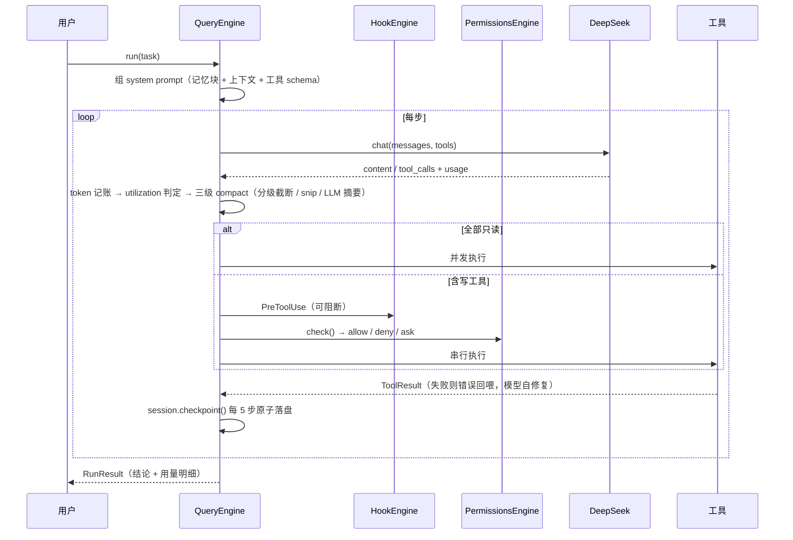

# CodeAgent — 自研小型 AI Coding Agent

参考 [Claude Code](https://github.com/pengchengneo/Claude-Code) 源码架构，用 Python 从零实现的 coding agent：
**核心循环手写**（不套 LangGraph / Agent SDK），支撑层用成熟库（openai SDK / pydantic v2 / streamlit / typer / pytest）。

> **一句话**：把 Claude Code 的架构用 Python 重写一遍——不是移植代码，是移植设计。
> 7,175 行源码 / 25 个模块 / 449 个测试。真实跑分见[评估章节](#评估eval)。
📄 文档：[技术方案 `docs/TECH_SPEC.md`](docs/TECH_SPEC.md) · [架构详解 `docs/architecture.md`](docs/architecture.md) · [任务清单 `TASKS.md`](TASKS.md) · [参考笔记 `docs/reference/`](docs/reference/)

---

## 为什么值得一看

市面上的教学型 coding agent 大多止步于「while 循环调工具」。这个项目把注意力放在**长会话里真正会出问题的地方**：上下文怎么不爆、缓存怎么省钱、崩溃怎么续跑、记忆怎么跨会话生效、改得对不对谁来判。

| 能力 | 说明 | 对应 Claude Code 机制 |
|---|---|---|
| **cache-aware 上下文布局** | 稳定前缀（system+task 固定不动）+ 三级 compact，让 DeepSeek 磁盘缓存持续命中；控制台实时画命中率与省钱曲线 | TOKEN_BUDGET / CONTEXT_COLLAPSE |
| **step 级检查点 / 崩溃恢复** | 每 N 步原子落盘 state，`--resume` 从最近检查点**接着 step 计数**续跑；任务中途 kill 进程不丢进度。**节拍随会话落盘**：`--resume` 不带 `--checkpoint-every` 时沿用会话当初的值，并把生效值打出来 | `/resume` |
| **block-at-submit hooks** | `PreToolUse` 包裹 `git commit`，`data/tests_pass.marker` 不存在就**阻断**——逼 agent 进入「测试并修复」循环；marker 只在**测试命令真跑成功**时由 `PostToolUse` 写入，失败即清除 | Hooks（block-at-submit） |
| **真·轨迹驱动评估** | 从 tinydb 真实 git history 挖 bug 修复提交构造黄金任务，隐藏测试判分，出完成率/成本回归报告 | SWE-bench 思路 |
| **分层记忆 + 自进化** | `CODEAGENT.md` / `CLAUDE.md` / `.codeagent/rules/*.md` 分层 + `@include` + hash 去重 + 预算；任务后提取约定写回，**下次会话自动生效** | CLAUDE.md 机制 |
| **research 子代理** | 把 `(X+Y)×N` 的探索外包，主上下文只收结论 `Z`；子代理只读、无 subagent 工具（天然禁递归） | SubAgent 上下文经济学 |
| **MCP 客户端** | 手写 MCP stdio 客户端接入标准 MCP server；**第三方工具照样过权限与 hooks**，且**默认不放行**——必须列进 `mcp.json` 的 `allow` 才免确认 | MCP（工具接入标准） |
| **第三方工具授权** | `Tool.is_external()` → 权限引擎单独归类，默认 `ask`（无交互确认 → 拒绝），拒绝文案带出处与解除方式；子进程环境按名清洗凭据类变量 | 权限与安全审查 |
| **注入文本检测 + 会话污染标记** | `agent/security.py` 对已知文本模式做**概率性**检测（只出告警）；`high` 标记让**三类不可逆动作**（网络外发 / 读凭据 / 写记忆文件）在 `PermissionsEngine` 的**后置天花板**上从 allow 降为 ask —— 该位置在记忆之后，`allow_always` 短路不了它 | 权限与安全审查 |
| **联网工具 + SSRF 拦截** | `web_fetch` / `web_search` 两个工具；**先解析域名再判结果 IP**（判 hostname 字面量是漏的），解析失败即拒绝；`::ffff:` 映射、CGNAT、NAT64/6to4 内嵌地址都拆开判；**每一跳重定向都重查**（只数跳数不校验目标等于不设防）。顺带让上面那条天花板的「网络外发」第一次有了真实对象 | WebFetch / WebSearch |
| **提问暂停 / 续答** | 信息不足时 agent 调 `ask_user` **停下**并把问题打出来；`--resume "你的回答"` 把回复送进会话接着跑。「打断」是**数据标志**（`ToolResult.await_user`）而非阻塞控制流，所以 headless 评测只要不注册这个工具就完全不受影响 | `ask_user` 工具 / 澄清提问 |
| **skills 渐进披露** | 工作区放 `SKILL.md`，**只有 name + 简介**进 system prompt，正文由 `load_skill` 按需取 —— 装 50 个 skill 也不额外占常驻 token | Skills（渐进披露） |
| **改动前复核** | `Tool.preview()` 在**写盘之前**产出 diff 交给权限确认（`edit` / `write`），权限从「事后报告」变「事前审批」；`--review-edits` 打开交互确认。diff 与执行**共用同一份匹配语义**，不会出现「预览说能改、执行说不唯一」 | 权限确认带 diff（事前审批） |
| **计划清单跨回合** | `update_plan` 写 `state.plan`，**随检查点落盘**：中途 kill 或换会话续跑都不丢；`--plan` 可无 key 直接查看。每次传**完整清单**（不是增量），状态只有一个写入者 | TodoWrite / 计划清单 |
| **工具输出分级截断** | compact 流水线的**第 0 级**：按工具给不同预算先缩内容，缩不够才删消息；`grep`/`pytest` 的**结论在尾部**，所以是 head 70% + tail 30% 而不是只留头部；**失败结果给更大预算**（错误原文是模型自修复的依据）。**只在越过 warning 线时才跑**，低于阈值逐字节不碰（保住前缀缓存）| 上下文分级截断 |

> ⚠️ 最后一行（分级截断）**实测收益比设计预期小**：端到端命中率没降，但单次截断要付 8.8 倍的 miss token，且免不掉下一级。**去留已拍板：保持现状**（理由与完整数据见 [分级截断的真实代价](#分级截断的真实代价端到端看不见微观对照看得见) 与 `TASKS.md` 的 P7-d）。

> 上表最后四项是 M8 按参考实现的**设计**重写的（未复制任何代码），出处与「哪些明确不吸收」见 [MiniCode 笔记 §8](docs/reference/minicode-notes.md)。

### 实测：缓存命中率曲线（真·冷启动）

cache-aware 布局不是设计推理，是**测出来的**。下面是 DeepSeek 官方通路（`deepseek-chat`）一次**真·冷启动**的逐步缓存命中——所谓冷启动是真的没命中：换一个没跑过的新 workspace 目录，`{workspace_root}` 变了 → system prompt 前缀不同 → provider 侧缓存必然为空，所以 step 1 的命中率是 **0%**。

```
step  prompt   hit   miss   命中率
   1    2411      0   2411    0%     ← 冷启动：整段前缀首次出现
   2    2534   2304    230   91%
   3    2797   2560    237   92%
   4    3147   2816    331   89%
   5    3345   3200    145   96%
   6    3433   3200    233   93%
                                 累计 80%（6 步修完 bug，prompt 共 17,667 token）
```

这张表说明的就是 cache-aware 布局在做的事：**稳定前缀（system + 任务 + 工具 schema）一旦被缓存，后续每一步的 prompt 增量（新工具结果）只需付 miss 的钱**。命中量随步数单调增长（2304 → 2560 → 2816 → 3200），因为每一步都在给已缓存的前缀续上新的一段。

> 一个容易自欺的坑：同一条命令连着跑第二遍，step 1 就不再是 0% 了（前缀还在 provider 的磁盘缓存里，实测能到 85% 起步）。**那不是冷启动曲线**——要测冷启动必须换一个没跑过的工作目录。

> 表里这一版是 **2026-09-11 用当时的 system prompt 复测的**（M8 给 prompt 加了 `update_plan` 引导语与 `ask_user` 槽位，旧版那条 1,376 起步的曲线属于更早的 prompt，已作废）。复测的意义不只是换数字：**这份曲线和「三级 compact」是同一份代码跑出来的**，所以它是下面那条截断结论的基线。

### 分级截断的真实代价：端到端看不见，微观对照看得见

「只在越过 warning 线时才动」这条设计不变量是对的，但**实测出来的收益比设计预期小得多，而且代价的形状和当初想的不一样**。两句话说完：

- **端到端命中率没有下降**：两臂只差 `_truncate_oversized` 开/关，两个压力区间跑下来 B−A 都在 **±0.02%** 以内（区间①两臂的累计 hit token 甚至逐 token 相同：319,616）。
- **但这不等于代价为零**。截断触发的那一步，下一级的 LLM 摘要**也在同一步触发**，缓存本来就整段失效——代价被淹在里面了。把一次截断单独拎出来做对照：它省下 5,128 token，代价是 **45,304 个 miss token（8.8 倍）**，该步命中率从 100% 掉到 28%。

代价的形状是**后缀失效**：`_head_tail` 保留头部 70%，前缀缓存一路匹配到那 70% 处才分叉，**被改的那条之后全部算未命中**。所以代价不取决于截掉多少字符，取决于**它后面还压着多少** —— 同样截 4,000 字符，截第 7 条（后面 12 条）少命中 50,432 token，截第 17 条（后面 2 条）只少 13,312，差 **3.8 倍**。好在它是**一次性**的：同一份截断后的 messages 重发一次，miss 从 45,442 回到 134。

它同样**没能免掉下一级**：中段窗口要到 20 条消息才非空，而那时 utilization 已经到 1.06 / 1.23，远在 0.85 之上；一次释放的 token 只值预算的 5.9~7.4 个百分点，每步增量却是 11~13 个百分点——追不上。真实小仓库的工具输出（本仓库真跑时最大 430 字符）更是连 4,000 字符的 `read` 预算都够不着，第 0 级被调用 8~13 次、**一次可截的都没有**。

唯一稳定为正的收益是**尾部结论行 8/8 次保住**（`grep`/`pytest` 的结论在尾部，只留头等于把最该看的部分丢掉）——这条设计约束是对的，且实测每次都守住。**去留已拍板：保持现状** —— 不选"优先截最靠后的合格消息"（缓存代价能降到 1/3.8）是因为它会**先丢掉最老的上下文**，而"最近的最相关"是比缓存算术更硬的约束。完整数据见 [TASKS.md 的 P7-d 一节](TASKS.md)。

另外吸收了 [MiniCode](https://github.com/LiuMengxuan04/MiniCode) 的长会话治理经验：provider-usage-first token 记账、超大工具结果落盘+预览、确定性 snip 裁剪、空响应重试、细粒度权限决策。

---

## 架构

```mermaid
flowchart TB
    subgraph ENTRY["入口层 app/"]
        CLI["app/cli.py<br/>typer CLI · --resume"]
        UI["app/ui_streamlit.py<br/>实时事件 · 权限按钮 · 指标曲线"]
        RP["app/replay.py<br/>检查点回放"]
    end

    subgraph CORE["核心循环 agent/"]
        LOOP["loop.py · QueryEngine<br/>think → tool → observe → finish<br/>只读并发 / 写工具串行"]
        LLM["llm.py<br/>DeepSeekClient · MockLLM<br/>usage + cache 采集"]
        STATE["state.py<br/>AgentState + OpenAI 消息构造"]
        CTX["context.py<br/>provider-usage-first 记账<br/>cache-aware 布局 + 三级 compact"]
        TR["tool_result.py<br/>超大结果落盘 + 预览"]
        SESS["session.py<br/>JSONL 轨迹 + 检查点 + resume"]
    end

    subgraph SKILL["渐进披露 agent/skills.py"]
        SK["skills.py<br/>SKILL.md 发现 + 索引渲染<br/>正文按需加载"]
    end

    subgraph GOV["治理层 agent/"]
        PERM["permissions.py<br/>once/turn/always + 黑名单 + 沙箱"]
        HOOK["hooks.py<br/>Pre/PostToolUse + block-at-submit"]
        MEM["memory.py<br/>分层指令文件 + @include + 提取"]
    end

    subgraph TOOLS["工具层 agent/tools/"]
        BASE["base.py<br/>Tool 基类 + pydantic schema"]
        BASH["bash.py<br/>沙箱 + 危险命令拦截"]
        FILES["files.py<br/>read · write · edit · glob · grep"]
        WEB["web.py<br/>web_fetch · web_search<br/>+ SSRF 拦截"]
        SUB["subagent.py<br/>research 子代理（只读）"]
        ASK["ask.py<br/>ask_user 提问暂停"]
        PLAN["plan.py<br/>update_plan 计划清单"]
        SKT["skills.py<br/>load_skill 取正文"]
    end

    subgraph EVAL["评估层 eval/"]
        GT["golden_tasks.py<br/>tinydb 真实 fix 提交 → 任务"]
        RUN["runner.py<br/>完成率 / 成本 / 回归报告"]
    end

    CLI --> LOOP
    UI --> LOOP
    LOOP --> LLM
    LOOP --> STATE
    LOOP --> CTX
    LOOP --> PERM
    LOOP --> HOOK
    LOOP --> SESS
    LOOP --> BASE
    BASE --> BASH
    BASE --> FILES
    BASE --> WEB
    BASE --> SUB
    BASE --> ASK
    BASE --> PLAN
    BASE --> SKT
    CTX --> TR
    MEM --> STATE
    RUN --> GT
    RUN --> LOOP
    RP --> SESS
    SK --> SKT
    SK -. 索引进 system prompt .-> STATE
    SUB -. 复用自己的 QueryEngine .-> LOOP
```



一轮循环长这样：



---

## 快速开始

```bash
git clone git@github.com:Goat-Donk/mini-coding.git && cd mini-coding
pip install -e ".[dev]"                  # 依赖声明见 pyproject.toml
cp .env.example .env                     # 填入 DEEPSEEK_API_KEY（只走 .env，绝不提交）
```

**无 key 也能跑**（MockLLM 脚本化演示，真实执行 glob 等只读工具）：

```bash
python -m app.cli --mock "读 README 并总结项目结构"
streamlit run app/ui_streamlit.py        # 控制台，勾选「Mock 演示」
```

> ⚠️ **Windows 上 Streamlit 默认端口可能起不来**：默认 8501 常落在系统保留端口段里
> （本机是 `8457-8556`，`netsh interface ipv4 show excludedportrange protocol=tcp` 可查），
> 表现为日志只说 `Port 8501 is not available`、实际是 `WinError 10013 权限不允许`。
> 换个不在保留段的端口即可：`streamlit run app/ui_streamlit.py --server.port 8600`。

**接真实 DeepSeek**：

```bash
python -m app.cli "给 README 加一行说明并验证"
python -m app.cli --resume               # 从最近检查点续跑（配合 Ctrl+C 杀进程演示）
python -m app.cli --resume --clear-taint # 复位污染标记（误报被收紧时用它解锁）
python -m app.cli --resume "补充的信息"   # 回答 agent 的提问后续跑（agent 调 ask_user 停下来时）
python -m app.cli --plan                 # 只看最近会话的**任务计划清单**后退出（不需要 API key）
python -m app.cli --mcp .codeagent/mcp.json "任务"   # 加载 MCP server（第三方工具）
```

**联网任务**：`web_fetch` / `web_search` 默认就在工具集里（`ToolRegistry.default()`）。

```bash
CODEAGENT_SEARCH_BACKEND=bing python -m app.cli "查一下 Python 3.13 的发布日期并写进 release.md"
```

> **默认搜索后端是 `ddg`（对齐 TS 参考实现），但它在境内网络下连不通**：`lite.duckduckgo.com`
> 直连超时、走代理 SSL 中断（本机实测两种都试过）。所以真要用联网，先 `CODEAGENT_SEARCH_BACKEND=bing`。
> 说清楚一件事：**DDG 那条解析路径没有对着真实响应校准过**（连不上就没法校准），Bing 的解析才是照着
> 真实响应写的。这个事实写在代码注释和 `TASKS.md` 里，而不是让它看起来像验证过。
>
> `web_fetch` 会拦内网地址（本机/私网/云元数据端点/CGNAT/内网 IPv6，含 `::ffff:`、NAT64、6to4 的
> 内嵌地址），**每一跳重定向都重查一遍**，域名解析失败一律拒绝。它拦的是「打内网」，不是「防注入」——
> 数据外发那条线由权限层的污染天花板管（`high` 时这两个工具也要人工确认）。

CLI 的事件日志是**实时流式**的：工具调用一发生就打一行（`[步 3] ✓ bash(command=python -m pytest -q) [1200ms]`），
bash 退出码非 0 会额外标 `[exit code: N]`，不用等任务结束才看到进度。

CLI 的每一次工具调用都**统一过权限引擎与 hooks**（和 Streamlit 控制台同一条链路，由 `hooks.default_engine()` 一处构造）：默认 `allow`，
所以正常流程行为不变；危险命令（`rm -rf` / `git push` / `git reset --hard` …）判定为 `ask`，
而 CLI 没有交互确认，于是按安全默认**拒绝**并把理由回喂模型；路径越界沙箱则直接 `deny`。
hooks 侧是 block-at-submit：`git commit` 在 `data/tests_pass.marker` 不存在时被拦下，
marker 由 `PostToolUse` 在**测试命令真跑成功**（退出码 0）时自动写入、失败时清除。

**改动前复核（`--review-edits`）**：加上这个开关，`edit` / `write` 会把**将要写下去的 diff** 显示出来等你选
（1 允许一次 / 2 本回合允许 / 3 一直允许 / 4-6 对应拒绝；直接回车 = 拒绝）。diff 取自 `Tool.preview()`
——**在 `permissions.check()` 之前**取，所以人看到它时磁盘上还是旧内容；匹配不上时显示的是失败原因
（"old_string 匹配到 3 处"）而不是空白。

```bash
python -m app.cli "修掉 calc.py 里的减法 bug" --review-edits
```

> **为什么是开关而不是默认**：TS 参考实现的 `edit` 是默认要批准的（靠 TTY 模式兜住），
> 而**我们的 CLI 没有交互确认**——把 `edit` 改成默认 `ask` 会让每次改动都退化成拒绝、整条 CLI 不可用。
> 所以默认值留在 `allow`，需要复核时再打开。同理，默认路径下这个 diff **到不了人眼前**，
> 它只在 `--review-edits`、污染天花板收紧、或显式规则把工具抬成 `ask` 这三条路上出现。

**接 MCP server**（复制 [`mcp.example.json`](mcp.example.json) 为 `.codeagent/mcp.json`）：

```json
{"servers": {"fs": {
  "command": ["npx", "-y", "@modelcontextprotocol/server-filesystem", "."],
  "allow": ["read_file", "list_directory"]
}}}
```

MCP 工具**必须显式配置才注册**——第三方 server 不受 workspace 沙箱约束，所以只读性只信 server 声明的
`readOnlyHint`（没声明就当可写、串行执行），但它们**照样走权限与 hooks 门禁链**。

> **⚠️ 行为变更（M7）**：MCP 工具**列进 `allow` 才免确认**，没列的一律判定 `ask` ——
> CLI 无交互确认 → 拒绝，并把「给对应 server 加 `allow`」写进拒绝理由回喂模型。
> 在此之前它们是零策略放行的（`_classify` 落到通用 `tool` 分类 → 兜底 `ALLOW`），
> 即「接上第三方 server 就默认信任」。`allow` 支持通配（`"e*"`、`"*"`），写 `"*"` 是显式选择全放行。

**跑评估**（真实仓库 + 隐藏测试判定）：

```bash
python -m eval.golden_tasks --clone --limit 10   # 拉 tinydb，列出真实 fix 提交
python -m eval.runner --limit 3                  # 跑 3 个黄金任务，出回归报告
python -m eval.runner --limit 2 --mock           # 无 key 冒烟：只验证管线连通
```

**测试**：

```bash
python -m pytest tests/                  # 340 passed
```

---

## 评估（eval）

评估集**不是编的**：`eval/golden_tasks.py` 直接读 tinydb 的 git history，筛出「subject 含 fix 关键字 **且**同时改了源码与 tests」的提交，然后：

- `task_text` = 该提交的 subject + body（**真实 bug 报告**，不重写）
- `base_sha` = 该提交的**父提交**（bug 存在状态，`git worktree add --detach` 物化成干净工作区）
- `hidden_tests` = 该提交里 `tests/` 的新内容——**agent 全程看不到**，只在 judge 阶段覆盖写回跑 pytest

这样绕开了 SWE-bench 类任务的两个经典陷阱：**测试泄漏**（判定测试被 agent 读到）和**任务描述失真**（把真实 bug 改写成谜语）。

`python -m eval.golden_tasks --clone --limit 10` 在本机真实发现的提交（前 6 条）：

```
770486ff  fix: freeze unhashable args in Query.test to prevent TypeError (#618)
e70f9b1d  fix: correct Table.update transform type hints (#621)
76d21d26  fix: skip missing doc_ids in Table.update and Table.remove (#616)
dcf0a013  fix: correctly handle falsy values in LRUCache
781fb6ca  fix: LRUCache.set update cache value when key exists
1fa99fb3  fix: make query callables work again
```

> ⚠️ **关于 mock 冒烟**：`--mock` 只验证管线连通。MockLLM 不修 bug，所以完成率必然是 0 —— 那是**正确**的判定结果（测试真的跑了并且真的失败），不是 bug。

### 实测结果（真实跑分，非预置）

下面这组数字是**本机真实跑出来的**（DeepSeek 官方 API `https://api.deepseek.com` + `deepseek-chat`），不是写死在仓库里的：

```
$ python -m eval.runner --limit 2
完成率 50%（1/2 个有效任务） · token 82,495 · 估算成本 ¥0.0769 · 平均缓存命中率 82%

  ✗ 770486ff  fix: freeze unhashable args in Query.test…    8步 45961t ¥0.041  21.2s
  ✓ e70f9b1d  fix: correct Table.update transform type hints 8步 36534t ¥0.036  18.3s
报告已存: data/eval/report-20260911-112304.json
```

判定依据（judge 跑隐藏测试的真实输出，已落进报告）：

| 任务 | judge 输出 | 结论 |
|---|---|---|
| `770486ff` | `1 failed, 32 passed` — `TypeError: unhashable type: 'dict'` 仍在 | 没修好 |
| `e70f9b1d` | `109 passed` | 真修好了 |

> **口径说明（必读）**：
> - 本组数字来自**项目选定通路**（DeepSeek 官方，代码默认值即此），缓存命中率是官方 `usage.prompt_cache_hit_tokens` / `(hit+miss)` 的**原生口径**。
> - **这组数字在 M9-2 之后重跑过，与之前的 62,812 / ¥0.0625 / 83% 不可直接比**：M9-2 把 `web_fetch` / `web_search` 注册进了 `ToolRegistry.default()`，而 eval 用的就是这个 `default()` —— 于是两个工具的 schema 进了每次请求的 tools 段，token 从 62.8k 升到 82.5k（+31%）。**判定结论一字未变**（两个任务的 judge 输出完全相同：`1 failed, 32 passed` / `109 passed`）。这是「给 agent 加能力」的诚实代价：能力不是免费的，多两个工具的 schema 就要多付 token。
> - 早期曾用 DashScope（阿里百炼）的 OpenAI 兼容端点 + `deepseek-v4-flash` 做过一次临时验证（同一批任务：1/2 完成、269,767 token、命中率 89%）。那是**临时手段、已弃用**，两组的命中率口径不同、数值不可直接比。同样的任务在官方 `deepseek-chat` 上步数与 token 都显著更低（12/25 步 → 8/8 步，269.8k → 62.8k token，M9-2 后为 82.5k），但**样本只有 2 个任务，不足以支撑"某模型更强"的结论**，仅作记录。
> - 本机 agentrouter 的 key 走不通（它只放行 Claude Code 客户端，自写程序一律 `401 unauthorized client detected`，实测 6 种认证头组合 × 2 个端点全部 401）。要接自己的程序，用官方 API key。
> - **换自己的 key 重跑即可复现**：`python -m eval.runner --limit 2`。

**一个真实踩过的坑（已修 + 已加回归测试）**：tinydb 的 `pytest.ini` 写死了 `--cov-append --cov-report term --cov tinydb`，本机没装 pytest-cov 时 pytest 会以 **usage error（退出码 4）直接退出**——测试一次都没跑。而 judge 原本只看 `returncode == 0`，于是把它算成"agent 没修好"，完成率被压成假的 **0%**。修法：judge 用 `-o addopts=` 清掉仓库自带 addopts，并把退出码 2/3/4/5（压根没跑成）识别为**无效判定**计入 `error`，不再污染完成率。同一个 bug 修前修后：`0/2` → `1/2`。

**一条方法论上的自我更正**：M6-7 里我把「往 system prompt 注入工作目录」的 commit message 写成了「修 `--resume` 迷路的真根因」。后来用**同一任务、同一仓库、只换 system prompt** 做了 A/B，**步数收益没复现**（6 步 vs 6 步，两边都修好、都无瞎猜路径；`--resume` 续跑场景同样无差别）。因此如实改口径为**防御性健壮性改进**，并单独记录探针挖到的真差异：本机 `pwd` 被 Git for Windows 的 `pwd.exe` 抢占，返回 `/d/...` 这种 **POSIX 路径**（在 Windows 上不是合法路径），`cd` 才是对的——已写进平台提示。详见 [TASKS.md](TASKS.md) 与 [docs/interview_guide.md](docs/interview_guide.md) §10。

报告字段：完成率（分母只算有效判定）/ 逐任务 steps / token / 耗时 / 成本（按 DeepSeek 公开定价 ¥0.5·¥2·¥8 每 M tokens 估算）/ 缓存命中率 / **judge 的 pytest 摘要**；agent 或 judge 抛异常会**如实记入 `error` 字段**，不会伪装成通过。

---

## 项目规模（真实统计）

| 层 | 文件 | 行数 |
|---|---|---|
| 核心循环 | `agent/loop.py` `llm.py` `state.py` `context.py` `tool_result.py` `session.py` | 1,833 |
| 治理 | `agent/permissions.py` `hooks.py` `memory.py` `security.py` | 1,499 |
| 技能 | `agent/skills.py` | 271 |
| 工具 | `agent/tools/base.py` `bash.py` `files.py` `web.py` `subagent.py` `ask.py` `plan.py` `skills.py` | 1,771 |
| MCP | `agent/mcp.py` | 386 |
| 入口 | `app/cli.py` `ui_streamlit.py` `replay.py` | 925 |
| 评估 | `eval/golden_tasks.py` `runner.py` | 490 |
| **源码合计** | **25 个模块** | **7,175** |
| 测试 | `tests/` | 7,440（449 个用例） |

> 口径：源码 = `agent/` + `app/` + `eval/` 里**被 git 跟踪**的 `.py` 行数（不含 `eval/repos/` 下的克隆仓，它被 gitignore）；模块数 = 其中**非空**的 `.py` 文件数（4 个空 `__init__.py` 不计）。

---

## 目录结构

```
coding_agent/
├── CLAUDE.md              # 精炼约定 + 索引（新会话自动加载）
├── TASKS.md               # 勾选式任务清单（M1~M8，进度快照）
├── docs/
│   ├── TECH_SPEC.md       # 详细技术方案：签名 / 数据结构 / 边界 / 测试用例
│   ├── architecture.md    # 架构详解（逐层对应 CC 源码）
│   ├── interview_guide.md # 面试讲解稿
│   └── reference/         # CC 源码 / MiniCode / offer-Master 调研笔记
├── agent/                 # 核心循环 + 治理 + 工具
├── app/                   # CLI + Streamlit 控制台 + 检查点回放
├── eval/                  # 黄金任务集 + 回归 runner
├── tests/                 # pytest（每模块一个文件）
├── workspace/             # 演示工作区（.gitignore）
└── data/                  # 轨迹 / 检查点 / 报告（.gitignore）
```

---

## 设计取舍

**做**：核心循环手写 · 只读工具并发 · diff 语义编辑（唯一匹配 + 失败回喂自修复）· 权限沙箱 · hooks · 三级 compact · 检查点恢复 · 分层记忆 · research 子代理 · 轨迹驱动评估。

**不做**（范围控制，不是不会）：向量 RAG（CC 自己也是靠 grep/glob/read 检索）· Skills 的安装/市场/权限元数据（只做了 SKILL.md 渐进披露这一层，见能力表）· A2A · 多代理协调器 · 语音 / Vim / 远程 bridge / TUI 组件层——这些是 Claude Code 里「大规模」而非「核心」的部分。

**硬约束**：LLM 只用 DeepSeek（`deepseek-chat`），测试走 MockLLM · 所有文件操作限制在 `workspace_root` 沙箱内，bash 拦危险命令 · **数据全真实**，agent 操作真实仓库、评估用真实提交，不造假。

---

## 已知未修复的绕过路径

安全机制的可信度不来自「实现了什么」，而来自**它挡不住什么被写清楚了**。下面每一条都是当前代码的真实边界，逐条可复现；写在这里而不是留在脑子里，是因为一份只说能力的清单会让人高估它，而高估本身就是风险。

**先划清范围**：本项目**没有**做 prompt 注入防御。`agent/security.py` 是**概率性**的文本模式匹配，只用于告警与标记；真正收紧能力的只有 `PermissionsEngine` 的确定性门禁。一句话概括这个设计的位置：**注入能不能骗过模型，不由这个项目决定；被标记之后还能不能读走 key、发出去、写进记忆，由门禁决定。**

### 一、检测器（概率性，能绕过）

| # | 绕过路径 | 说明 |
|---|---|---|
| S1 | **改一个词就绕过** | 规则是文本匹配，`忽略之前的指令` 换成 `把先前的那些话作废` 即不命中。这是本方法的固有边界，不是没调好 |
| S2 | **逐字引用完整载荷的文档会判 high** | 词法扫描分不清「引用」与「使用」。顺带提及能挡住，逐字引用挡不住。已作为**已知误报**写进测试钉住 |
| S3 | **检测器扫自己的源码会命中自己** | `agent/security.py` 里逐字写着这些模式。除非做形状启发式（更不可靠），否则无解。实际影响：只有「读到这个文件」会触发 |
| S4 | **中文同义改写、跨行/跨段拼接、编码混淆**（base64、全角、Unicode 变体） | 均未覆盖。规则只覆盖明写的常见措辞 |
| S5 | **扫描范围 = 落进上下文的那些字节** | 工具截断之外的内容不扫。这是刻意的范围对齐（模型看不到的内容，扫它不增加保护），但也意味着**超长输出尾部的载荷不会被发现** |

### 二、门禁（确定性，但判据是词法的）

下面每条的「实测」都是我写了个只打印判定结果、不改动任何东西的探针（22 条命令）跑出来的真实结果，不是推演。

| # | 绕过路径 | 说明 |
|---|---|---|
| S6 | **`curl` 换成脚本就绕过网络外发判据** | `_irreversible_kind` 认的是 `curl/wget/nc/scp/...` 与 `requests.`/`httpx.` 等词。实测：`python upload.py`、`python -c "import http.client"` 均不命中。另有一个**词法前缀**导致的漏判：`powershell -c "Invoke-WebRequest -Uri http://x -Method POST"` 也不命中 —— 判据要求动词前是 `^`/空白/`;&|(`，而这里前面是引号 |
| S7 | **`.env` 改名即绕过凭据判据** | 认的是文件名。实测：`cat config.txt`、`cat secret.txt`、`cat ENV~1`（Windows 短名）均不命中；`python -c "print(open(chr(46)+'env').read())"`（运行时拼文件名）也不命中 |
| S8 | **bash 部分写法仍能写记忆文件** | 「写记忆文件」这条判据**末尾锚定**，所以 `echo hi > CLAUDE.md`（`CLAUDE.md` 前是空格不是 `^`/分隔符）实测**不命中**；`python -c "open('CLAUDE.md','w')"` 同样不命中。命中的是 `.codeagent/rules/` 那半边（实测 `echo hi >> .codeagent/rules/learned.md` 命中）——因为它不以 `$` 锚定 |
| S9 | **`high` 只在**当前**会话生效** | 标记随会话结束而结束。新会话是干净的 —— 这对可用性是必要的，但也意味着攻击可以「一个会话投毒，下个会话收割」，只要中间没有人类的复位动作参与 |
| S10 | **判定用的是原始参数字符串** | 没做路径规范化后再匹配。**但凭据这一类已经不受影响了**：bash 的判据在 M7 验证后改成了「只要**提到**凭据文件即命中、不锚定末尾」，实测 `cat ./.env`、`cat sub/../.env`、`cat .env.local`、`type "C:\proj\.env"`、`cat $HOME/.env`、`cp .env /tmp/x`、`certutil -encode .env out.txt` 全部命中。剩下的规范化缺口在 Windows 短名（`ENV~1`，见 S7）与未列入文件名清单的凭据文件 |

**S10 的代价是故意的收紧**，一并写在这里免得被当成 bug：因为判据从「读动词 + 凭据路径」放宽成「提到凭据文件」，`grep -rn "\.env" README.md` 这种**只是提及**这个词的命令，在 `high` 会话里也会被收紧成「需人工确认」。取舍理由是：一句话能讲清的规则（「high 会话里提到凭据文件的 bash 命令都要人工确认」）比一张要不断补的读动词表可靠 —— 动词表是打地鼠（`cat`/`type`/`findstr`/`Select-String`/`grep`/`awk`/`sed`/`od`/`strings`/`python -c` …），漏一个就等于这类动作**完全没有**天花板；而多收紧一条的代价，人的 `--clear-taint` 一句话就能解除。

顺带说明一处**不属于本表**的命中：`git push origin main` 的 `_irreversible_kind` 是 `None`，但它本来就由 bash 工具自带的危险模式判成 `ask` —— 走的是另一层，不是污染天花板。

### 三、结构性（未做完整覆盖）

| # | 绕过路径 | 说明 |
|---|---|---|
| S11 | **MCP 工具不受 workspace 沙箱约束** | 默认 `ask` 是**策略**，不是隔离。显式 `allow` 之后，第三方 server 做什么由它自己决定 —— 这不是沙箱，只是授权开关 |
| S12 | **子进程环境清洗是按名黑名单** | `*_API_KEY` / `*_TOKEN` / `*_SECRET` / `*PASSWORD*` / `AWS_*` / `*_CREDENTIAL*`。改个名（`MY_PRIVATE_STUFF=xxx`）即绕过。**不是保证** |
| S13 | **记忆文件仍会原样进 system prompt** | 只加了来源标注与框架声明，没有内容审查。克隆一个仓库，它自带的 `CLAUDE.md` 依然会被注入 —— 门槛从「无声注入」抬到「声明了来源、模型被要求报告越界要求」，但**没有阻断** |
| S14 | **`@include` 的目录黑名单是枚举的** | 只拒了 `data/tool-results/`。agent 自己写出的其它目录（如 `data/sessions/`）没在名单里 |
| S15 | **没有子代理/工具层的隔离** | 子代理是「受限只读工具集」，不是沙箱。它跑在同一进程、同一 workspace、同一份环境变量下 |
| S16 | **bash 子进程根本不经过路径沙箱** | 这是 M7 验证时实测到的、也是这份清单里最该先修的一条：`read`/`write`/`edit` 的越界检查走 `_resolve`（第一优先级硬 deny），但 **bash 的 `command` 参数没有任何路径越界判据** —— 沙箱是「工具层的路径解析」，而 bash 把它整个绕过去了。实测：工作区里 `type ..\.env` 与 `cat ../.env` 各自返回 336 字节、内容含**真实 key**（对照组：`read` 工具读同一路径被硬 deny）。环境变量清洗（S12）挡住了最短的那条路，但挡不住这一条 |

**这份清单会过时**：它不是「设计上不允许」，是「截至 `a455dda` 还没做」。逐条修掉其中任何一条，都应该同时改这张表。

### 四、这四条是**真跑过真实 LLM** 验出来的（不是单测）

上面这些边界里，有几条不是读代码推出来的，是拿 DeepSeek 官方通路真跑出来的（不是 mock）：

| 验证 | 做法 | 真实结果 |
|---|---|---|
| 环境变量外泄 | 同一命令跑两次：一次传 `env=None`（修复前语义），一次传 `_scrubbed_env()` | 前一次输出 35 字节、**含真实 key**；后一次输出 18 字节、字面量 `%DEEPSEEK_API_KEY%`。真跑 agent 时它把 `%DEEPSEEK_API_KEY%` 写进了文件，`sk-` 出现 0 次 |
| MCP 授权 | 同一个 server（`mcp-server-time`）、同一个任务，只改 `allow` | 不配 `allow` → 工具被拒，拒绝文案带出处与**确切改法**；配上 → `MCP 授权: 2/2 个工具免确认`，真实时间返回 |
| 注入检出 → 收紧 → 人解锁 | 工作区放一个含载荷的文件，让 agent 读到 | 轨迹里有 `security_finding`（5 个规则族 / 7 处命中 / 行号 / `level=high`，**不含原文摘录**）与 `gate_block`（带 `source` 与完整理由）；`--clear-taint` 复位后重试成功 |
| **不锁定** | agent 自己写含载荷的测试文件、再读回、再跑 `pytest` | 8 次工具调用、**0 次 `gate_block`**、任务正常完成 —— 这是「只收紧不可逆动作」这条误报政策的验收点 |

**这轮验证挖出并修掉了两个真 bug**（都在 `a455dda`，各带一条回归测试）：

1. **天花板在实践中是空转的。** 原先 bash 的凭据分支要求「读动词 + 凭据路径」同现，动词表是 `cat|type|head|tail|less|more|Get-Content|gc`；模型读 `.env` 用的却是 `findstr ... .env`（Windows 上 `grep` 的自然替代）—— 不在表里，于是**天花板没生效**：命令正常执行，变量名进了上下文。这是「单测全绿但机制实际不工作」的典型样本。
2. **`--resume "补充说明"` 会静默丢掉这个参数。** 拒绝文案让用户「用 `--clear-taint` 复位后再重试」，但复位之后 CLI 没有办法把「我已复位，请重试」送进会话（`run_from` 用的是 `state.task`）。模型按文案指引停下等人，人却回不了话 —— 整条「收紧 → 人解锁 → 重试」的动线断在最后一步。真跑时就是这么卡住的。

---

## 参考与来源

- [pengchengneo/Claude-Code](https://github.com/pengchengneo/Claude-Code) — 主参考（查询循环 / 工具接口 / 上下文管理 / hooks / 权限）→ [笔记](docs/reference/claude-code-notes.md)
- [LiuMengxuan04/MiniCode](https://github.com/LiuMengxuan04/MiniCode)（TS，MIT）— 长会话上下文治理 → [笔记](docs/reference/minicode-notes.md)
  - M8 的四项机制（提问暂停 / skills 渐进披露 / 计划清单 / 分级截断）**照其设计重写，未复制任何代码**：本地那份第三方 Python 移植（`minicode/` 59,852 行）**自有部分未声明授权**，且即便授权允许，照抄也会让「核心循环手写」这个定位失效。取舍与「明确不吸收」清单见笔记 §8。
- [offer-Master](https://github.com/happyFigure/offer-Master) — 工程分层组织 → [笔记](docs/reference/offer-master-notes.md)
- [Anthropic: Building Effective Agents](https://www.anthropic.com/engineering/building-effective-agents) — workflow vs agent 的边界
