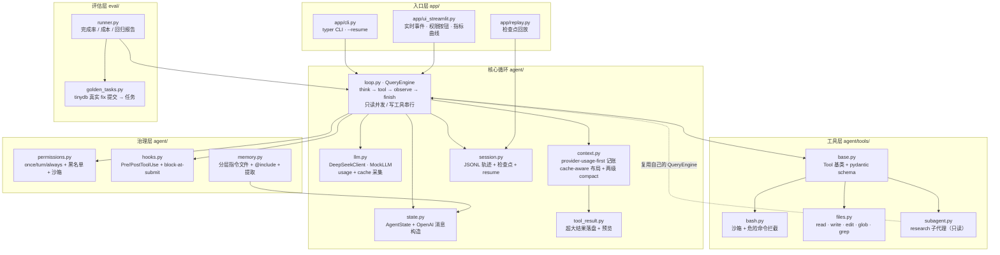
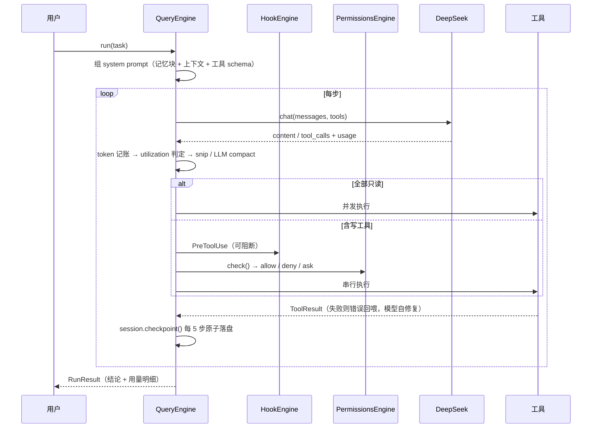

# CodeAgent — 自研小型 AI Coding Agent

参考 [Claude Code](https://github.com/pengchengneo/Claude-Code) 源码架构，用 Python 从零实现的 coding agent：
**核心循环手写**（不套 LangGraph / Agent SDK），支撑层用成熟库（openai SDK / pydantic v2 / streamlit / typer / pytest）。

> **一句话**：把 Claude Code 的架构用 Python 重写一遍——不是移植代码，是移植设计。
> 4,170 行源码 / 19 个模块 / 189 个测试。真实跑分见[评估章节](#评估eval)。

📄 文档：[技术方案 `docs/TECH_SPEC.md`](docs/TECH_SPEC.md) · [架构详解 `docs/architecture.md`](docs/architecture.md) · [任务清单 `TASKS.md`](TASKS.md) · [参考笔记 `docs/reference/`](docs/reference/)

---

## 为什么值得一看

市面上的教学型 coding agent 大多止步于「while 循环调工具」。这个项目把注意力放在**长会话里真正会出问题的地方**：上下文怎么不爆、缓存怎么省钱、崩溃怎么续跑、记忆怎么跨会话生效、改得对不对谁来判。

| 能力 | 说明 | 对应 Claude Code 机制 |
|---|---|---|
| **cache-aware 上下文布局** | 稳定前缀（system+task 固定不动）+ 两级 compact，让 DeepSeek 磁盘缓存持续命中；控制台实时画命中率与省钱曲线 | TOKEN_BUDGET / CONTEXT_COLLAPSE |
| **step 级检查点 / 崩溃恢复** | 每 5 步原子落盘 state，`--resume` 从最近检查点**接着 step 计数**续跑；任务中途 kill 进程不丢进度 | `/resume` |
| **block-at-submit hooks** | `PreToolUse` 包裹 `git commit`，`data/tests_pass.marker` 不存在就**阻断**——逼 agent 进入「测试并修复」循环 | Hooks（block-at-submit） |
| **真·轨迹驱动评估** | 从 tinydb 真实 git history 挖 bug 修复提交构造黄金任务，隐藏测试判分，出完成率/成本回归报告 | SWE-bench 思路 |
| **分层记忆 + 自进化** | `CODEAGENT.md` / `CLAUDE.md` / `.codeagent/rules/*.md` 分层 + `@include` + hash 去重 + 预算；任务后提取约定写回，**下次会话自动生效** | CLAUDE.md 机制 |
| **research 子代理** | 把 `(X+Y)×N` 的探索外包，主上下文只收结论 `Z`；子代理只读、无 subagent 工具（天然禁递归） | SubAgent 上下文经济学 |
| **MCP 客户端** | 手写 MCP stdio 客户端接入标准 MCP server；**第三方工具照样过权限与 hooks**（分层设计的回报） | MCP（工具接入标准） |

### 实测：缓存命中率曲线（真·冷启动）

cache-aware 布局不是设计推理，是**测出来的**。下面是 DeepSeek 官方通路（`deepseek-chat`）一次**真·冷启动**的逐步缓存命中——所谓冷启动是真的没命中：换个新的 workspace 目录，`{workspace_root}` 变了 → system prompt 前缀不同 → provider 侧缓存必然为空，所以 step 1 的命中率是 **0%**。

```
step  prompt   hit   miss   命中率
   1    1376      0   1376    0%     ← 冷启动：整段前缀首次出现
   2    1502   1280    222   85%
   3    1939   1536    403   79%
   4    2120   1920    200   91%
   5    2294   2048    246   89%
   6    2365   2176    189   92%
                                 累计 77%（6 步修完 bug，12,064 token）
```

这张表说明的就是 cache-aware 布局在做的事：**稳定前缀（system + 任务 + 工具 schema）一旦被缓存，后续每一步的 prompt 增量（新工具结果）只需付 miss 的钱**。命中量随步数单调增长（1280 → 1536 → 1920 → 2048 → 2176），因为每一步都在给已缓存的前缀续上新的一段。

> 一个容易自欺的坑：同一条命令连着跑第二遍，step 1 就不再是 0% 了（前缀还在 provider 的磁盘缓存里，实测能到 85% 起步）。**那不是冷启动曲线**——要测冷启动必须换一个没跑过的工作目录。

另外吸收了 [MiniCode](https://github.com/LiuMengxuan04/MiniCode) 的长会话治理经验：provider-usage-first token 记账、超大工具结果落盘+预览、确定性 snip 裁剪、空响应重试、细粒度权限决策。

---

## 架构



一轮循环长这样：



---

## 快速开始

```bash
git clone git@github.com:Goat-Donk/mini-coding.git && cd mini-coding
pip install -e ".[dev]"                  # 依赖声明见 pyproject.toml
cp .env.example .env                     # 填入 DEEPSEEK_API_KEY（只走 .env，绝不提交）
```

**无 key 也能跑**（MockLLM 脚本化演示，真实执行 glob 等只读工具）：

```bash
python -m app.cli --mock "读 README 并总结项目结构"
streamlit run app/ui_streamlit.py        # 控制台，勾选「Mock 演示」
```

> ⚠️ **Windows 上 Streamlit 默认端口可能起不来**：默认 8501 常落在系统保留端口段里
> （本机是 `8457-8556`，`netsh interface ipv4 show excludedportrange protocol=tcp` 可查），
> 表现为日志只说 `Port 8501 is not available`、实际是 `WinError 10013 权限不允许`。
> 换个不在保留段的端口即可：`streamlit run app/ui_streamlit.py --server.port 8600`。

**接真实 DeepSeek**：

```bash
python -m app.cli "给 README 加一行说明并验证"
python -m app.cli --resume               # 从最近检查点续跑（配合 Ctrl+C 杀进程演示）
python -m app.cli --mcp .codeagent/mcp.json "任务"   # 加载 MCP server（第三方工具）
```

CLI 的事件日志是**实时流式**的：工具调用一发生就打一行（`[步 3] ✓ bash(command=python -m pytest -q) [1200ms]`），
bash 退出码非 0 会额外标 `[exit code: N]`，不用等任务结束才看到进度。

CLI 的每一次工具调用都**统一过权限引擎**（和 Streamlit 控制台同一条链路）：默认 `allow`，
所以正常流程行为不变；危险命令（`rm -rf` / `git push` / `git reset --hard` …）判定为 `ask`，
而 CLI 没有交互确认，于是按安全默认**拒绝**并把理由回喂模型；路径越界沙箱则直接 `deny`。

**接 MCP server**（复制 [`mcp.example.json`](mcp.example.json) 为 `.codeagent/mcp.json`）：

```json
{"servers": {"fs": {"command": ["npx", "-y", "@modelcontextprotocol/server-filesystem", "."]}}}
```

MCP 工具**必须显式配置才注册**——第三方 server 不受 workspace 沙箱约束，所以只读性只信 server 声明的
`readOnlyHint`（没声明就当可写、串行执行），但它们**照样走权限与 hooks 门禁链**。

**跑评估**（真实仓库 + 隐藏测试判定）：

```bash
python -m eval.golden_tasks --clone --limit 10   # 拉 tinydb，列出真实 fix 提交
python -m eval.runner --limit 3                  # 跑 3 个黄金任务，出回归报告
python -m eval.runner --limit 2 --mock           # 无 key 冒烟：只验证管线连通
```

**测试**：

```bash
python -m pytest tests/                  # 189 passed
```

---

## 评估（eval）

评估集**不是编的**：`eval/golden_tasks.py` 直接读 tinydb 的 git history，筛出「subject 含 fix 关键字 **且**同时改了源码与 tests」的提交，然后：

- `task_text` = 该提交的 subject + body（**真实 bug 报告**，不重写）
- `base_sha` = 该提交的**父提交**（bug 存在状态，`git worktree add --detach` 物化成干净工作区）
- `hidden_tests` = 该提交里 `tests/` 的新内容——**agent 全程看不到**，只在 judge 阶段覆盖写回跑 pytest

这样绕开了 SWE-bench 类任务的两个经典陷阱：**测试泄漏**（判定测试被 agent 读到）和**任务描述失真**（把真实 bug 改写成谜语）。

`python -m eval.golden_tasks --clone --limit 10` 在本机真实发现的提交（前 6 条）：

```
770486ff  fix: freeze unhashable args in Query.test to prevent TypeError (#618)
e70f9b1d  fix: correct Table.update transform type hints (#621)
76d21d26  fix: skip missing doc_ids in Table.update and Table.remove (#616)
dcf0a013  fix: correctly handle falsy values in LRUCache
781fb6ca  fix: LRUCache.set update cache value when key exists
1fa99fb3  fix: make query callables work again
```

> ⚠️ **关于 mock 冒烟**：`--mock` 只验证管线连通。MockLLM 不修 bug，所以完成率必然是 0 —— 那是**正确**的判定结果（测试真的跑了并且真的失败），不是 bug。

### 实测结果（真实跑分，非预置）

下面这组数字是**本机真实跑出来的**（DeepSeek 官方 API `https://api.deepseek.com` + `deepseek-chat`），不是写死在仓库里的：

```
$ python -m eval.runner --limit 2
完成率 50%（1/2 个有效任务） · token 62,812 · 估算成本 ¥0.0625 · 平均缓存命中率 83%

  ✗ 770486ff  fix: freeze unhashable args in Query.test…    8步 30935t ¥0.030  22.5s
  ✓ e70f9b1d  fix: correct Table.update transform type hints 8步 31877t ¥0.033  15.5s
报告已存: data/eval/report-20260910-192731.json
```

判定依据（judge 跑隐藏测试的真实输出，已落进报告）：

| 任务 | judge 输出 | 结论 |
|---|---|---|
| `770486ff` | `1 failed, 32 passed` — `TypeError: unhashable type: 'dict'` 仍在 | 没修好 |
| `e70f9b1d` | `109 passed` | 真修好了 |

> **口径说明（必读）**：
> - 本组数字来自**项目选定通路**（DeepSeek 官方，代码默认值即此），缓存命中率是官方 `usage.prompt_cache_hit_tokens` / `(hit+miss)` 的**原生口径**。
> - 早期曾用 DashScope（阿里百炼）的 OpenAI 兼容端点 + `deepseek-v4-flash` 做过一次临时验证（同一批任务：1/2 完成、269,767 token、命中率 89%）。那是**临时手段、已弃用**，两组的命中率口径不同、数值不可直接比。同样的任务在官方 `deepseek-chat` 上步数与 token 都显著更低（12/25 步 → 8/8 步，269.8k → 62.8k token），但**样本只有 2 个任务，不足以支撑"某模型更强"的结论**，仅作记录。
> - 本机 agentrouter 的 key 走不通（它只放行 Claude Code 客户端，自写程序一律 `401 unauthorized client detected`，实测 6 种认证头组合 × 2 个端点全部 401）。要接自己的程序，用官方 API key。
> - **换自己的 key 重跑即可复现**：`python -m eval.runner --limit 2`。

**一个真实踩过的坑（已修 + 已加回归测试）**：tinydb 的 `pytest.ini` 写死了 `--cov-append --cov-report term --cov tinydb`，本机没装 pytest-cov 时 pytest 会以 **usage error（退出码 4）直接退出**——测试一次都没跑。而 judge 原本只看 `returncode == 0`，于是把它算成"agent 没修好"，完成率被压成假的 **0%**。修法：judge 用 `-o addopts=` 清掉仓库自带 addopts，并把退出码 2/3/4/5（压根没跑成）识别为**无效判定**计入 `error`，不再污染完成率。同一个 bug 修前修后：`0/2` → `1/2`。

**一条方法论上的自我更正**：M6-7 里我把「往 system prompt 注入工作目录」的 commit message 写成了「修 `--resume` 迷路的真根因」。后来用**同一任务、同一仓库、只换 system prompt** 做了 A/B，**步数收益没复现**（6 步 vs 6 步，两边都修好、都无瞎猜路径；`--resume` 续跑场景同样无差别）。因此如实改口径为**防御性健壮性改进**，并单独记录探针挖到的真差异：本机 `pwd` 被 Git for Windows 的 `pwd.exe` 抢占，返回 `/d/...` 这种 **POSIX 路径**（在 Windows 上不是合法路径），`cd` 才是对的——已写进平台提示。详见 [TASKS.md](TASKS.md) 与 [docs/interview_guide.md](docs/interview_guide.md) §10。

报告字段：完成率（分母只算有效判定）/ 逐任务 steps / token / 耗时 / 成本（按 DeepSeek 公开定价 ¥0.5·¥2·¥8 每 M tokens 估算）/ 缓存命中率 / **judge 的 pytest 摘要**；agent 或 judge 抛异常会**如实记入 `error` 字段**，不会伪装成通过。

---

## 项目规模（真实统计）

| 层 | 文件 | 行数 |
|---|---|---|
| 核心循环 | `agent/loop.py` `llm.py` `state.py` `context.py` `tool_result.py` `session.py` | 1,273 |
| 治理 | `agent/permissions.py` `hooks.py` `memory.py` | 688 |
| 工具 | `agent/tools/base.py` `bash.py` `files.py` `subagent.py` | 740 |
| MCP | `agent/mcp.py` | 350 |
| 入口 | `app/cli.py` `ui_streamlit.py` `replay.py` | 629 |
| 评估 | `eval/golden_tasks.py` `runner.py` | 490 |
| **源码合计** | **19 个模块** | **4,170** |
| 测试 | `tests/` | 3,032（189 个用例） |

---

## 目录结构

```
coding_agent/
├── CLAUDE.md              # 精炼约定 + 索引（新会话自动加载）
├── TASKS.md               # 勾选式任务清单（M1~M6，进度快照）
├── docs/
│   ├── TECH_SPEC.md       # 详细技术方案：签名 / 数据结构 / 边界 / 测试用例
│   ├── architecture.md    # 架构详解（逐层对应 CC 源码）
│   ├── interview_guide.md # 面试讲解稿
│   └── reference/         # CC 源码 / MiniCode / offer-Master 调研笔记
├── agent/                 # 核心循环 + 治理 + 工具
├── app/                   # CLI + Streamlit 控制台 + 检查点回放
├── eval/                  # 黄金任务集 + 回归 runner
├── tests/                 # pytest（每模块一个文件）
├── workspace/             # 演示工作区（.gitignore）
└── data/                  # 轨迹 / 检查点 / 报告（.gitignore）
```

---

## 设计取舍

**做**：核心循环手写 · 只读工具并发 · diff 语义编辑（唯一匹配 + 失败回喂自修复）· 权限沙箱 · hooks · 两级 compact · 检查点恢复 · 分层记忆 · research 子代理 · 轨迹驱动评估。

**不做**（范围控制，不是不会）：向量 RAG（CC 自己也是靠 grep/glob/read 检索）· Skills 系统 · A2A · 多代理协调器 · 语音 / Vim / 远程 bridge / TUI 组件层——这些是 Claude Code 里「大规模」而非「核心」的部分。

**硬约束**：LLM 只用 DeepSeek（`deepseek-chat`），测试走 MockLLM · 所有文件操作限制在 `workspace_root` 沙箱内，bash 拦危险命令 · **数据全真实**，agent 操作真实仓库、评估用真实提交，不造假。

---

## 参考与来源

- [pengchengneo/Claude-Code](https://github.com/pengchengneo/Claude-Code) — 主参考（查询循环 / 工具接口 / 上下文管理 / hooks / 权限）→ [笔记](docs/reference/claude-code-notes.md)
- [LiuMengxuan04/MiniCode](https://github.com/LiuMengxuan04/MiniCode) — 长会话上下文治理 → [笔记](docs/reference/minicode-notes.md)
- [offer-Master](https://github.com/happyFigure/offer-Master) — 工程分层组织 → [笔记](docs/reference/offer-master-notes.md)
- [Anthropic: Building Effective Agents](https://www.anthropic.com/engineering/building-effective-agents) — workflow vs agent 的边界
