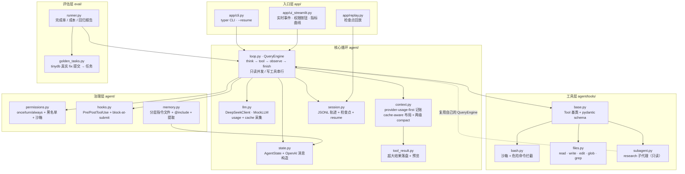
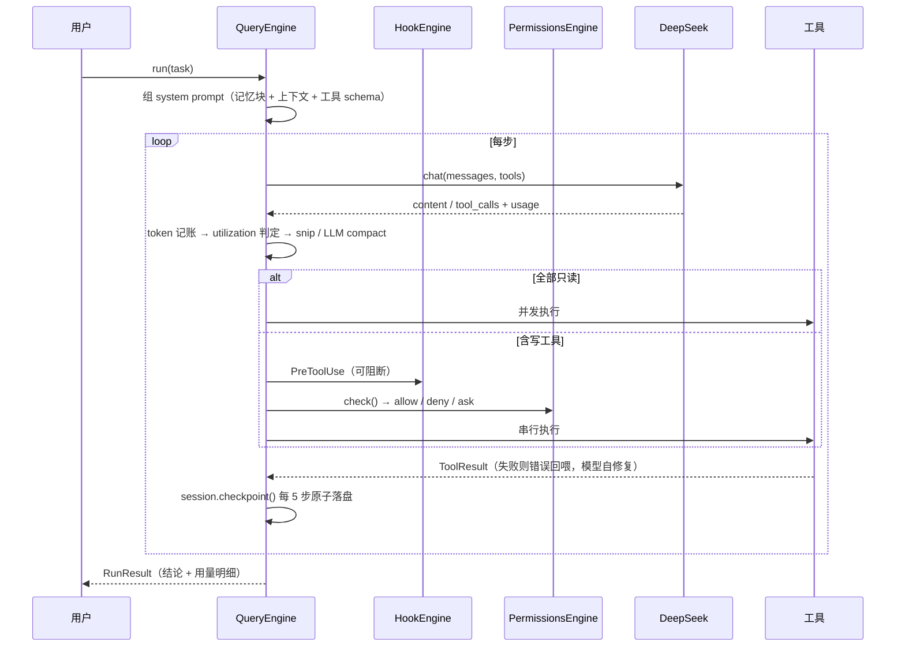

# CodeAgent — 自研小型 AI Coding Agent

参考 [Claude Code](https://github.com/pengchengneo/Claude-Code) 源码架构，用 Python 从零实现的 coding agent：
**核心循环手写**（不套 LangGraph / Agent SDK），支撑层用成熟库（openai SDK / pydantic v2 / streamlit / typer / pytest）。

> **一句话**：把 Claude Code 的架构用 Python 重写一遍——不是移植代码，是移植设计。
> 3,645 行源码 / 18 个模块 / 156 个测试。

📄 文档：[技术方案 `docs/TECH_SPEC.md`](docs/TECH_SPEC.md) · [架构详解 `docs/architecture.md`](docs/architecture.md) · [任务清单 `TASKS.md`](TASKS.md) · [参考笔记 `docs/reference/`](docs/reference/)

---

## 为什么值得一看

市面上的教学型 coding agent 大多止步于「while 循环调工具」。这个项目把注意力放在**长会话里真正会出问题的地方**：上下文怎么不爆、缓存怎么省钱、崩溃怎么续跑、记忆怎么跨会话生效、改得对不对谁来判。

| 能力 | 说明 | 对应 Claude Code 机制 |
|---|---|---|
| **cache-aware 上下文布局** | 稳定前缀（system+task 固定不动）+ 两级 compact，让 DeepSeek 磁盘缓存持续命中；控制台实时画命中率与省钱曲线 | TOKEN_BUDGET / CONTEXT_COLLAPSE |
| **step 级检查点 / 崩溃恢复** | 每 5 步原子落盘 state，`--resume` 从最近检查点**接着 step 计数**续跑；任务中途 kill 进程不丢进度 | `/resume` |
| **block-at-submit hooks** | `PreToolUse` 包裹 `git commit`，`data/tests_pass.marker` 不存在就**阻断**——逼 agent 进入「测试并修复」循环 | Hooks（block-at-submit） |
| **真·轨迹驱动评估** | 从 tinydb 真实 git history 挖 bug 修复提交构造黄金任务，隐藏测试判分，出完成率/成本回归报告 | SWE-bench 思路 |
| **分层记忆 + 自进化** | `CODEAGENT.md` / `CLAUDE.md` / `.codeagent/rules/*.md` 分层 + `@include` + hash 去重 + 预算；任务后提取约定写回，**下次会话自动生效** | CLAUDE.md 机制 |
| **research 子代理** | 把 `(X+Y)×N` 的探索外包，主上下文只收结论 `Z`；子代理只读、无 subagent 工具（天然禁递归） | SubAgent 上下文经济学 |

另外吸收了 [MiniCode](https://github.com/LiuMengxuan04/MiniCode) 的长会话治理经验：provider-usage-first token 记账、超大工具结果落盘+预览、确定性 snip 裁剪、空响应重试、细粒度权限决策。

---

## 架构



一轮循环长这样：



---

## 快速开始

```bash
git clone git@github.com:Goat-Donk/mini-coding.git && cd mini-coding
pip install -e ".[dev]"                  # 依赖声明见 pyproject.toml
cp .env.example .env                     # 填入 DEEPSEEK_API_KEY（只走 .env，绝不提交）
```

**无 key 也能跑**（MockLLM 脚本化演示，真实执行 glob 等只读工具）：

```bash
python -m app.cli --mock "读 README 并总结项目结构"
streamlit run app/ui_streamlit.py        # 控制台，勾选「Mock 演示」
```

**接真实 DeepSeek**：

```bash
python -m app.cli "给 README 加一行说明并验证"
python -m app.cli --resume               # 从最近检查点续跑（配合 Ctrl+C 杀进程演示）
```

**跑评估**（真实仓库 + 隐藏测试判定）：

```bash
python -m eval.golden_tasks --clone --limit 10   # 拉 tinydb，列出真实 fix 提交
python -m eval.runner --limit 3                  # 跑 3 个黄金任务，出回归报告
python -m eval.runner --limit 2 --mock           # 无 key 冒烟：只验证管线连通
```

**测试**：

```bash
python -m pytest tests/                  # 156 passed
```

---

## 评估（eval）

评估集**不是编的**：`eval/golden_tasks.py` 直接读 tinydb 的 git history，筛出「subject 含 fix 关键字 **且**同时改了源码与 tests」的提交，然后：

- `task_text` = 该提交的 subject + body（**真实 bug 报告**，不重写）
- `base_sha` = 该提交的**父提交**（bug 存在状态，`git worktree add --detach` 物化成干净工作区）
- `hidden_tests` = 该提交里 `tests/` 的新内容——**agent 全程看不到**，只在 judge 阶段覆盖写回跑 pytest

这样绕开了 SWE-bench 类任务的两个经典陷阱：**测试泄漏**（判定测试被 agent 读到）和**任务描述失真**（把真实 bug 改写成谜语）。

`python -m eval.golden_tasks --clone --limit 10` 在本机真实发现的提交（前 6 条）：

```
770486ff  fix: freeze unhashable args in Query.test to prevent TypeError (#618)
e70f9b1d  fix: correct Table.update transform type hints (#621)
76d21d26  fix: skip missing doc_ids in Table.update and Table.remove (#616)
dcf0a013  fix: correctly handle falsy values in LRUCache
781fb6ca  fix: LRUCache.set update cache value when key exists
1fa99fb3  fix: make query callables work again
```

> ⚠️ **诚实的说明**：mock 冒烟只验证管线连通（MockLLM 不修 bug，所以完成率必然是 0——这是**正确**的判定结果，不是 bug）。真实跑分需要 `DEEPSEEK_API_KEY`，本仓库**不预置任何跑分数字**，请自行运行 `python -m eval.runner --limit N` 得到属于你的报告（落 `data/eval/report-*.json`）。

报告字段：完成率 / 逐任务 steps / token / 耗时 / 成本（按 DeepSeek 公开定价 ¥0.5·¥2·¥8 每 M tokens 估算）/ 缓存命中率；agent 或 judge 抛异常会**如实记入 `error` 字段**，不会伪装成通过。

---

## 项目规模（真实统计）

| 层 | 文件 | 行数 |
|---|---|---|
| 核心循环 | `agent/loop.py` `llm.py` `state.py` `context.py` `tool_result.py` `session.py` | 1,210 |
| 治理 | `agent/permissions.py` `hooks.py` `memory.py` | 688 |
| 工具 | `agent/tools/base.py` `bash.py` `files.py` `subagent.py` | 740 |
| 入口 | `app/cli.py` `ui_streamlit.py` `replay.py` | 555 |
| 评估 | `eval/golden_tasks.py` `runner.py` | 452 |
| **源码合计** | **18 个模块** | **3,645** |
| 测试 | `tests/` | 2,269（156 个用例） |

---

## 目录结构

```
coding_agent/
├── CLAUDE.md              # 精炼约定 + 索引（新会话自动加载）
├── TASKS.md               # 勾选式任务清单（M1~M6，进度快照）
├── docs/
│   ├── TECH_SPEC.md       # 详细技术方案：签名 / 数据结构 / 边界 / 测试用例
│   ├── architecture.md    # 架构详解（逐层对应 CC 源码）
│   ├── interview_guide.md # 面试讲解稿
│   └── reference/         # CC 源码 / MiniCode / offer-Master 调研笔记
├── agent/                 # 核心循环 + 治理 + 工具
├── app/                   # CLI + Streamlit 控制台 + 检查点回放
├── eval/                  # 黄金任务集 + 回归 runner
├── tests/                 # pytest（每模块一个文件）
├── workspace/             # 演示工作区（.gitignore）
└── data/                  # 轨迹 / 检查点 / 报告（.gitignore）
```

---

## 设计取舍

**做**：核心循环手写 · 只读工具并发 · diff 语义编辑（唯一匹配 + 失败回喂自修复）· 权限沙箱 · hooks · 两级 compact · 检查点恢复 · 分层记忆 · research 子代理 · 轨迹驱动评估。

**不做**（范围控制，不是不会）：向量 RAG（CC 自己也是靠 grep/glob/read 检索）· Skills 系统 · A2A · 多代理协调器 · 语音 / Vim / 远程 bridge / TUI 组件层——这些是 Claude Code 里「大规模」而非「核心」的部分。

**硬约束**：LLM 只用 DeepSeek（`deepseek-chat`），测试走 MockLLM · 所有文件操作限制在 `workspace_root` 沙箱内，bash 拦危险命令 · **数据全真实**，agent 操作真实仓库、评估用真实提交，不造假。

---

## 参考与来源

- [pengchengneo/Claude-Code](https://github.com/pengchengneo/Claude-Code) — 主参考（查询循环 / 工具接口 / 上下文管理 / hooks / 权限）→ [笔记](docs/reference/claude-code-notes.md)
- [LiuMengxuan04/MiniCode](https://github.com/LiuMengxuan04/MiniCode) — 长会话上下文治理 → [笔记](docs/reference/minicode-notes.md)
- [offer-Master](https://github.com/happyFigure/offer-Master) — 工程分层组织 → [笔记](docs/reference/offer-master-notes.md)
- [Anthropic: Building Effective Agents](https://www.anthropic.com/engineering/building-effective-agents) — workflow vs agent 的边界
