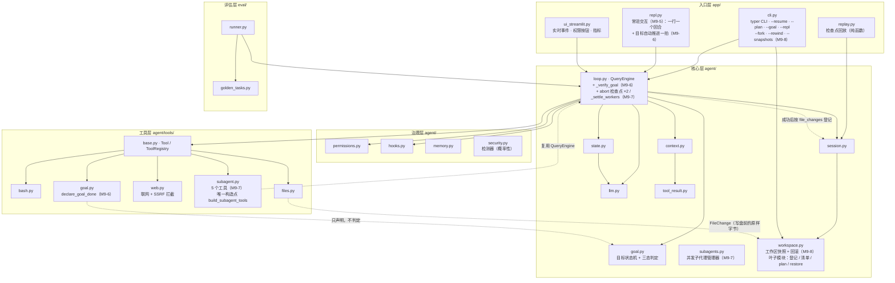
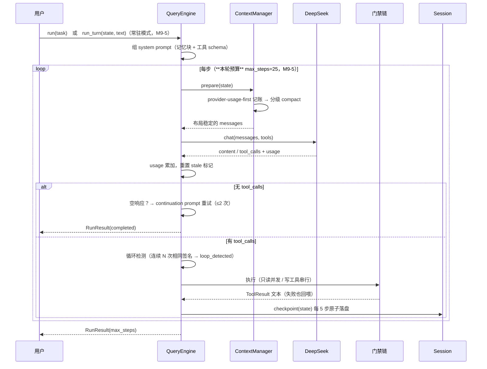
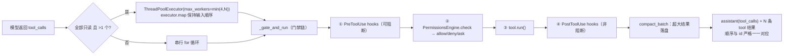
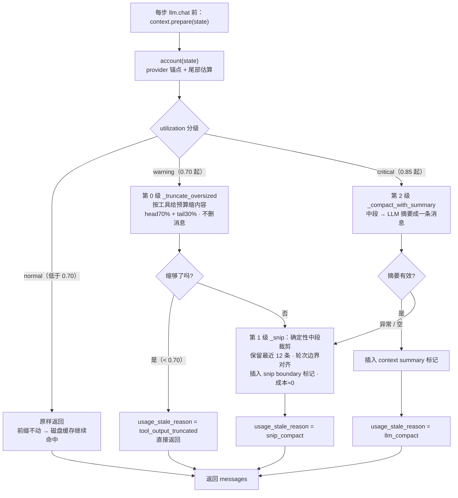
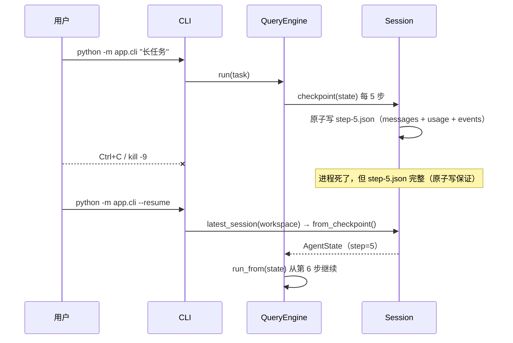
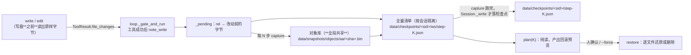
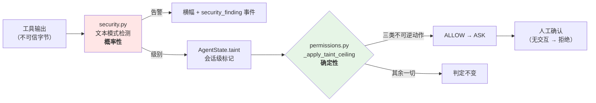
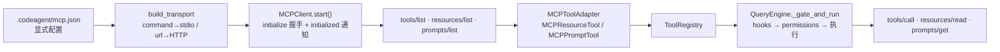
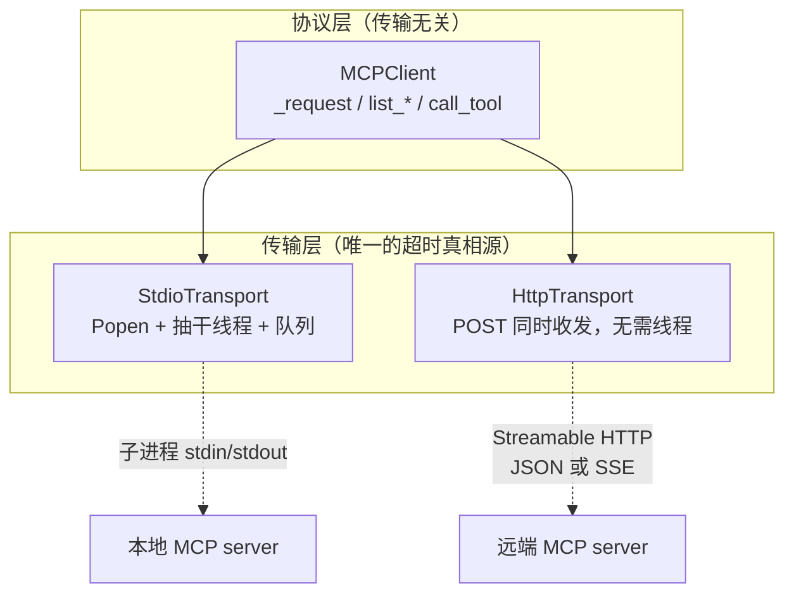
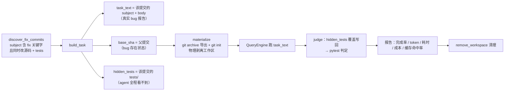

# CodeAgent 架构详解

> 逐层拆解 CodeAgent 的设计，并标注每一层对应 [Claude Code 源码](https://github.com/pengchengneo/Claude-Code) 的哪个机制。
> 配套阅读：[`docs/TECH_SPEC.md`](TECH_SPEC.md)（签名级规格）· [`docs/reference/claude-code-notes.md`](reference/claude-code-notes.md)（调研笔记）

## 0. 三条设计原则

1. **运行时拥有循环，模型只输出动作。** 循环、步数上限、终止判定、权限、落盘全部在 `QueryEngine` 里；LLM 每轮只做一件事——返回 `content` 或 `tool_calls`。这与 Claude Code 的 `QueryEngine.ts`、offer-Master 的 `LoopAgentController` 同构：**agent 的可靠性来自运行时的确定性，而不是提示词的祈祷。**
2. **核心手写，支撑层用成熟库。** 循环 / 工具协议 / 上下文治理 / 权限 / 检查点全部手写——这是「懂 agent 底层」的证据；HTTP 调用（openai SDK）、schema 校验（pydantic v2）、UI（streamlit）、CLI（typer）用成熟库，不重复造轮子。
3. **不确定的地方要能恢复，而不是假设不会发生。** 空响应 → 重试；工具失败 → 错误回喂模型自修复；compact 的 LLM 摘要失败 → 退化为确定性裁剪；进程被杀 → 检查点续跑；agent 没修好 bug → 评估如实记 0 分。

## 1. 分层与依赖方向

依赖**单向向下**：入口层 → 核心层 → 治理层/工具层；评估层旁挂（驱动核心层，不被核心层依赖）。核心层不 import streamlit / typer，所以能被 eval runner 和测试直接复用。



## 2. 一轮任务的生命周期



终止判定有八条出口，都会写进 `RunResult.terminated_reason`（轨迹和报告里可审计）。合法取值的**唯一清单**是 `agent/loop.py` 的 `TERMINATED_REASONS`（原先只有一行注释、没有集合 —— 加 M9-6 两个新值时补上，因为「一共有哪些值」这件事本身是真缺口）：

| terminated_reason | 触发条件 | 语义 |
|---|---|---|
| `completed` | 模型不再调工具（且内容非空，或空响应重试用尽） | 正常完成 |
| `max_steps` | 达到 `max_steps`（默认 25） | 坍缩防护：**每轮一份预算**（M9-5，见下） |
| `loop_detected` | 最近 4 步工具签名集合完全一致 | 坍缩防护：原地打转 |
| `error` | 循环内抛异常 | 明确失败，**不假装成功** |
| `await_user` | 模型调了 `ask_user`（`ToolResult.await_user=True`） | **半程暂停**，不是结论：等人补充信息后 `--resume "回答"` 续跑 |
| `goal_done` | **M9-6**：模型声明完成 + 人给的检查命令**退出码 0** | 目标达成，回合结束（把判分权拿走的代价见 README 末节） |
| `goal_check_invalid` | **M9-6**：检查命令**压根没跑成**（门禁拦下 / 超时 / 工具异常） | 判定无效，**既不算完成也不算未通过**；回合结束（模型改不了判据，留着它只会重复空转） |
| `aborted` | **M9-7**：`abort` token 已 set（在 `llm.chat` 之前、或串行批里的工具调用之前） | **worker 专有**：子代理被 `close_agent` 叫停。见下面的如实标注 |

> **`aborted` 是 worker 专有的（如实标注）**：它由 `AgentWorkers.spawn` 建的那一次性引擎产生。
> **父引擎拿不到它** —— 父会话唯一的取消是 `Ctrl+C`，那是 `BaseException`，在 `llm.chat` 里就
> 抛穿了 `except Exception`，走不到任何返回点。所以 `app/repl.py` 的 `BURST_STOP_REASONS` /
> `_STOP_REASONS` 里那两个 `"aborted"` 是「**方程要求它存在、但结构上不可达**」：`tests/test_goal.py`
> 的 `set(BURST_STOP_REASONS) | {"completed"} == TERMINATED_REASONS` 逐字逼着加 —— 那两条方程
> 本身正在做它们该做的事（防"新终止原因漏进 REPL 的判定"）。**也正因如此，`app/cli.py` 的
> `_extract_learned` 不加 `aborted` 守卫** —— 那是永远执行不到的分支，加了就是本项目的头号缺陷类。

> **`goal_check_invalid` 为什么不复用 `await_user`**：那个值连带两件事，两件都不对 —— `_extract_learned`
> 会跳过约定提炼（而这里的轨迹是完整的），REPL 会打印「需要你补充信息」（而这里没有人被提问）。
> 一个新值是诚实的代价。为什么**未通过**不在这张表里：它根本不是终止 —— 目标保持 `active`、
> 判定以 `user` 消息回喂，模型在同一回合里接着修。

> **`max_steps` 的语义（M9-5 变更）**：从「整个 state 的累计步数上限」改成
> **「本次运行 / 本回合的步数预算」**。`state.step` 本身照样累计不重置（检查点文件名
> `step-N.json`、`--fork --step K`、轨迹的 `step` 字段都依赖它单调递增），只改预算的
> **度量起点** —— `_run_loop` 进循环时记下 `budget_start = state.step`，条件从
> `state.step < max_steps` 变成 `state.step - budget_start < max_steps`。
> 旧语义下有一个陷阱：会话跑满 25 步之后 `--resume` 会**一次模型调用都不发**、
> 直接又打印「已达到最大步数（请拆分子任务）」，而错误信息指的方向还是错的。
> 在单发路径上两种语义等价（一个进程只有一个回合），所以这是**常驻模式逼出来的**修正。

## 3. 核心层

### 3.1 QueryEngine（`agent/loop.py`，874 行）

**只读工具并发，写工具串行** —— 直接照搬 Claude Code `query.ts` 的语义，也是与串行参考实现的主要差异：



关键约束：`executor.map` 而非 `as_completed`——**顺序必须与 `tool_calls` 一致**，因为 OpenAI 协议要求每条 `tool` 消息的 `tool_call_id` 与 assistant 的 `tool_calls` 对应，乱序会导致下一轮请求 400。

`_gate_and_run` 是统一门禁：**未知工具**（把可用工具名回喂，让模型自己改）、**hook 阻断**、**权限拒绝**都返回 `ToolResult.fail(...)`——工具层面没有「抛异常中断整个任务」，所有失败都是**文本回喂给模型自修复**。

### 3.2 LLM 抽象（`agent/llm.py`）

`BaseLLM` 两个实现，**接口完全一致**，所以循环、子代理、评估层共用一套代码：

- `DeepSeekClient`：走 openai SDK（DeepSeek 兼容 OpenAI 协议），`chat()` 返回 `LLMResult(content, tool_calls, usage)`，`complete()` 给 compact 摘要用。
- `MockLLM`：`script(*responses)` 脚本化响应序列 / `text("...")` 固定响应 / `tool_then_text(...)`。**测试与无 key 演示都靠它**——769 个测试全部离线，不打网络。

`Usage` 里单独保留 `prompt_cache_hit_tokens` / `prompt_cache_miss_tokens`——这是 DeepSeek 磁盘缓存的**实测**字段，整个缓存命中率指标和成本估算都建立在它之上（不是估算出来的）。

### 3.3 状态与消息契约（`agent/state.py`）

**OpenAI Chat Completion 格式的 dict 是 loop 与 LLM 之间的唯一契约**，`state.py` 用四个构造器保证格式 100% 合法：`system()` / `user()` / `assistant_text()` / `assistant_tool_calls()` / `tool_result()`。

`AgentState` 是「数据面」，也是检查点落盘的对象：`messages` / `step` / `usage` / `events` / `terminated_reason` / `memory_blocks`，加上 M3 的两个记账字段 `last_usage`（provider 锚点）与 `usage_stale_reason`、M7 的 `taint`、M8 的 `plan`（agent 自己的任务计划）、**M9-6 的 `goal`（人设的目标，见 §3.8）**——**检查点按 `dataclasses.fields()` 全字段快照**，所以加字段自动落盘；唯一的例外是 `emitter`（运行时对象，故意不落盘）。

> ⚠️ **加字段不等于加完事**：`load_state` 走 `AgentState(**raw)`，而 **dataclass 不做类型检查** ——
> 新字段必须在 `agent/session.py` 的 `_FIELD_DECODERS` 里补一行解码器，否则 `--resume` 之后
> 它是个 `dict` 而不是对象，直到有人读 `.status` 才抛错，而那个炸点会被 `_run_loop` 的
> `except Exception` 吞成 `terminated_reason="error"`，看起来像「引擎出错」。M9-6 的 `goal`
> 有一条测试 + 一条变异体专门钉这一行。

`record_event(type, **data)` 是唯一的埋点通道：事件进内存列表，**同时**经 `emitter` 回调写给 `Session`（JSONL + UI 实时流）。一处埋点，轨迹、控制台、评估三处消费。

### 3.4 上下文治理（`agent/context.py`，项目最核心的差异化）

**provider-usage-first 记账**（吸收自 MiniCode）：不去猜上下文有多大，而是**信任 provider 的实测值**——取最近一次 `llm.chat` 的 `usage.total_tokens` 作锚点，只对锚点之后的新增消息（尾部）做估算，`total = provider_total + 尾部估算`。compact 之后旧锚点失效，打上 `usage_stale_reason`，改为全量估算——**避免用旧 usage 度量新上下文**这个经典错误。

**三级 compact，先便宜后昂贵**（第 0 级只缩内容，第 1 级删消息，第 2 级才花钱调 LLM）：



**第 0 级的关键不变量**：**只在越过 0.70 时才跑**。低于阈值必须**逐字节不碰** ——
否则每个大工具结果在其生命周期内至少破坏一次前缀缓存。"只在阈值之上才动"不是优化开关，
破坏它**不会报错**：只有一条走平的命中率曲线和更贵的账单。`tests/test_context.py` 里
「utilization < 0.70 时消息逐字节不变」那条测试就是为它准备的（它是唯一挡得住这个改动的测试）。

**实测（2026-09-11，DeepSeek 官方通路；脚本与原始输出在 `m8verify/`，已 gitignore）**：
端到端 A/B（两臂只差本开关，两个压力区间）**命中率没降**，B−A 在 ±0.02% 以内，一个区间
两臂累计 hit token 逐 token 相同 —— 所以「不变量守住了」是**测出来的**。但**代价不是零，
只是被同一步触发的 LLM 摘要遮蔽了**：单次截断微观对照里，它省 5,128 token、付 **45,304
miss token（8.8 倍）**，该步命中率 100% → 28%（一次性，重发即回到基准）。代价的形状是
**后缀失效**——前缀缓存匹配到 `_head_tail` 保留的头部 70% 处才分叉，**被改的那条之后全算
未命中**，所以同样截 4,000 字符，截第 7 条比截第 17 条贵 **3.8 倍**。它**也没能免掉第 1/2 级**：
中段窗口要到 20 条消息才非空，那时 utilization 已 1.06~1.23。完整数据记在 `TASKS.md` 的
P7-d。**去留已拍板（2026-09-11）：保持现状** —— 不选"优先截最靠后的合格消息"是因为它
缓存账更好看但会**先丢掉最老的上下文**，而"最近的最相关"是比缓存算术更硬的约束。

**cache-aware 布局**（本项目独有，参考项目没有缓存概念）：`_PREFIX_LEN = 2`——**system + 首条 user 任务恒定在前两位**，compact 只动中段，绝不触碰前缀。DeepSeek 的磁盘缓存按前缀匹配，前缀稳定 → 命中率随会话推进持续上升，直接省钱。控制台把这条曲线画出来，并按**定价快照**（`agent/pricing.py`：命中 ¥0.5/M vs 未命中 ¥2/M，快照 `deepseek-chat@2025`，`status=archived`）实时估算省了多少钱 —— 单价只此一份，控制台与评估报告查的是同一张表。

这条布局在 M8 之后还多了**约束**的作用：移植任何机制前先问「它会不会改动 `_PREFIX_LEN`
之后的消息」。`update_plan` 就被它挡下过一次 —— 只取参考实现的**落盘**，不取它那种
**每步把计划快照注入对话**的做法（见 §4 与 MiniCode 笔记 §8）。

裁掉的中间消息**并没有丢**：完整内容仍在 `data/sessions/{sid}.jsonl` 里，snip/summary 标记都指向轨迹——所以检查点回放看到的是 compact 前的完整对话。

### 3.5 工具结果落盘（`agent/tool_result.py`）

纯截断会**丢信息**（模型再也看不到那部分内容）。改成落盘 + 预览：单条超阈值的结果写到 `data/tool-results/{session}/{id}.txt`，上下文里替换为「预览 + 完整路径」，模型（或用户）需要时能随时读回全文。`compact_batch` 还做**批次预算**——单条都没超，但一轮总量超限时按「最大优先」落盘。

### 3.6 会话、检查点、恢复（`agent/session.py`）

三个落盘职责，互不干扰：

| 产物 | 路径 | 写入时机 | 用途 |
|---|---|---|---|
| JSONL 轨迹 | `data/sessions/{sid}.jsonl` | 每个事件（append-only） | 完整审计；compact 裁掉的中段仍在此 |
| 检查点 | `data/checkpoints/{sid}/step-{N}.json` | 每 N 步（N 随会话落盘；`.tmp` → `replace` 原子写） | resume / 回放 |
| 工具结果原文 | `data/tool-results/{sid}/{id}.txt` | 超大结果产生时 | 上下文只留预览 + 路径 |



**续跑不重置 step 计数**——恢复的 `state.step` 继续推进，所以续跑产生的检查点不会覆盖恢复前的同名文件，轨迹里也没有歧义。

**节拍也是会话的事实**：`checkpoint_every` 随检查点落盘，`--resume` 不带这个参数时**沿用该会话当初的值**，不是回落 CLI 的默认 5。优先序是「显式传参 > 会话里记的 > 默认」，CLI 会把实际生效的节拍打印出来。这一条是 M8 真跑挖出来的第二半：第一半（`--resume --checkpoint-every 1` 传了不生效）更显眼，而这一半的代价同样是**静默**的——5 凑巧也是个合法节拍，命令成功、退出码 0，唯一证据是检查点数不涨。老检查点没有这个字段 → 回落默认；字段被手改坏 → 同样回落，**不夹成 1**（那会让一个已损坏的检查点变成"每步都写"）。

#### 分叉与命名（M9-3）

检查点是**逐步**落的，所以「回到第 K 步另开一条路」是现成能力 —— TS 原版的 `/fork` 是**会话级**的（整段复制、从"现在"接着走），我们挂在 step 级检查点上，可以指定**任意一步**。

```bash
python -m app.cli --sessions                        # 列出会话：名字 / 步数 / 分叉来源
python -m app.cli --rename "基线方案"                # 给最近会话起名（只动元数据，不需要 key）
python -m app.cli --fork --step 3 --rename "换个思路"  # 从第 3 步分叉（**对话**分叉，不动工作区）
python -m app.cli --resume --session-id "换个思路" "接着改"   # 名字和 id 都能用来指会话
```

**单独用时，它是对话分叉，不是工作区分叉。** 工作区文件**不会**回滚到第 K 步的样子，分叉后的 agent 看到的是**当前**的工作区。CLI 分叉后把这句打印出来，`--fork` 的 help 也写明。
**M9-8 之后这句话有了正面出口**：加 `--rewind` 就让文件也回到第 K 步（见 §3.10）。**而且这句话本身必须跟着 `--rewind` 分叉写** —— M9-8 之前它无条件说"工作区不会回滚"（那时是真的，没有回滚机制），现在带着 `--rewind` 时它会变成假话，而假话比不说更糟。

| 产物 | 路径 | 内容 |
|---|---|---|
| 会话元数据 | `data/sessions/{sid}.meta.json` | `name` + `forked_from`（合并式更新、原子写、自带 `session_id`）。**刻意不进检查点**：检查点放的是"任务跑到哪了"（要喂回引擎的状态），名字是人给的标签 |

搬三样，都以 fork 点为界：**检查点 `step-1..K`**（于是新会话还能 `--resume --step` 回到其中任意一步）、**轨迹里 `step <= K` 的行**（整份复制会让分叉会话"继承"源会话在 K 之后才发生的 `security_finding`）、**`forked_from`**（`--sessions` 用它显示血统）。副本里唯一按新会话重写的是 `session_id`。

检查点是**按节拍**落的，所以 `--fork --step K` 里的 K 可能压根没落盘（`--checkpoint-every 2` 的会话只有偶数步）。这时报的是 `第 K 步没有检查点（可用: [2, 4]）` 而不是一个裸文件路径 —— 分叉与续跑共用同一个读取入口，一条守卫管住两条路。

**`--sessions` 不是附赠**：没有它，`--rename` 写的名字与 `--fork` 记的血统**没有任何消费者** —— 机制在、测试绿、文档写了，但没有任何东西把人引到它上面。清单的键集合取「检查点目录 ∪ `data/sessions/*.jsonl`」，所以跑到一半被 kill、还没到第一个检查点的会话也在里面。

**名字的两条判据合起来才成立**：写入侧 `validate_name` 拒绝「与任何已有 session_id 或会话名相同」，读取侧 `resolve_session` **先当 id、再当名字**。少了写入侧的拒绝，重名会让 `--resume --session-id <名字>` 安静地跑到先遍历到的那个会话上（带着另一个任务的上下文）；名字等于某个 id 时那个 id 就永远解析不到自己。所以不去读取侧加优先级"猜"。

### 3.7 常驻交互模式（`app/repl.py`，M9-5）

**同一个 `AgentState` 连跑两次** —— REPL 不是新功能，是「换个用法」。它的价值恰在于
这个用法第一次让下面四条**单发进程里结构上不可观测**的契约成为真实路径：

| 契约 | 单发时为什么看不见 | 违反后的表现 |
|---|---|---|
| `run_turn` 复位 `terminated_reason` | "一个回合"和"一个进程"是同一件事 | 第二回合全程带着上一回合的旧值（控制台会从检查点里读出来显示） |
| `run_turn` 调 `permissions.new_turn()` | `_turn` 随进程一起消失，所以从没有过清空动作 | `allow_turn` 变成**永久放行**，与确认框写的「2) 本回合允许」矛盾 |
| `record_discovery` 认 `state.events` 去重 | 只有一轮，重放一次看不出来 | `skill_discovery` 每回合往轨迹里再写一份 |
| 入口 `ensure_tool_pairing` | 回合中途 Ctrl+C 后进程就死了，靠检查点恢复 | 下一轮请求是 400 形状，而**报错发生在下一回合**，与那次 Ctrl+C 看起来无关 |

**装配不复制。** `app/cli.py` 里原先 `QueryEngine(...)` 被构造了两遍（`--resume` 一条路、
全新会话一条路，参数逐字相同）—— 这本身就是「两处各写一遍」。收成 `_Runtime.engine(session)`
一处之后，单发与常驻从同一个地方拿引擎。REPL 若自己装配一遍（注册工具、接权限、接 hooks、
加载 MCP、装 `--review-edits` 的确认回调），迟早漏掉一样 —— **CLI 历史上漏接过 hooks 与
permissions 各一次，两次都是静默的**。

**两条硬不变量**：① 不认识的斜杠命令**绝不发给模型**（打错一个字母 = 一次真实的模型调用，
而回答看起来还挺像回事，所以这个错误不会被发现）；② 会话切换失败**不能半切换**（`_activate`
三样一起换，engine 必须跟着换 —— `QueryEngine.session` 是构造期绑定的；"session 换了、
engine/state 没换"是一个没有任何报错的错配：轨迹写进 A、你在看 B）。

**`await_user` 不需要任何特殊机制**：模型提问 → 本轮结束 → 打印问题 → 下一行输入就是回答。
这是 M8「把打断建模成数据标志而不是阻塞控制流」的回报 —— 反过来，若 REPL 自己 `input()`
一个"回答"，那才是把数据标志退化成阻塞控制流。

**退出时的承诺必须真能兑现**：`_farewell` 打印「继续: … `--repl --resume --session-id <sid>`」，
而检查点是**按节拍**写的、且**只在有工具调用的步上 tick** —— 纯聊天或只走两三步就退出，
一个检查点都不落，那条命令跑起来直接报"读不到检查点"。所以 `_wrap_up` **退出时强制落一次**
（理由与 `_awaiting_user` 里 `force=True` 相同：流程即将因非步数原因退出，节流的下一次 tick
永远等不来）。M7 的教训是「一条走不通的指引比没有指引更糟」—— 而这次那条指引是我们自己打印的。

**它明确不是全屏 TUI**（⑥ 已决定不做）：行式输入，没有 ANSI 控制、没有历史滚动。
多行输入缓冲 / 历史文件 / 自动补全也不做 —— 纯终端体验的体力活，对这份作品集要回答的
问题（循环、上下文、权限、可恢复性）不加分。

```bash
python -m app.cli --repl                        # 进提示符
python -m app.cli --repl "先跑一下测试"          # 带任务：它作为第一个回合
python -m app.cli --repl --resume --session-id <sid>   # 恢复后接着聊
python -m app.cli --repl --goal-turns 5         # 目标自动推进一拍最多几个回合（默认 3）
# 提示符内：/help /exit /new /resume /fork /plan /goal /sessions /rename /clear-taint
```

### 3.8 进程内目标（`agent/goal.py` + `agent/tools/goal.py`，M9-6）

REPL 让「一个进程 = 很多回合」成立；**目标**让「下一个回合」在没人敲字的时候自动接上。

> **它不是任务树。** TS 原版 ④ 的**唯一**证据是 `docs/reference/minicode-notes.md:141` 一行：
> 「进程内 Goal（跨回合推进 + 暂停/恢复/完成检查）」+ `/goal` `/goal status` `/goal pause [reason]`
> `/goal resume` `/goal clear` + `goal/context.ts`。那是一个**带状态机的目标对象**，没有任何层级结构。
> `isComplete` / 停止条件 / 任务树 / `TodoWrite` 全仓零命中。「允许中途改结构」现有 `update_plan`
> （全量覆盖）本来就能做。把"目标"想成树是很容易犯的错，因为名字听起来像 —— 但证据里没有树。

**① 判分权在人手里。** 目标由人用 `/goal <目标> --check <命令>` 创建，`check_command` 是**人预先给的
可执行判据**。模型只有一个工具 `declare_goal_done`——它**声明**"我觉得成了"，运行时随即去跑那条命令，
**退出码说了算**。模型不能创建目标、不能改判据、不能暂停/清空（同 `clear_taint` 的纪律：**标记不由
被标记者清除**）。工具刻意叫 `declare_...` 而不是 `complete_...`：它的 description 是这条能力在**唯一
常驻请求**（工具 schema）里的全部说明，而 `complete_goal` 读起来像"调用它 = 完成"—— 正是要避免的误解。

**② 完成检查的判定是三态，不是两态。**

| 判定 | 目标 | 回喂 | 事件 | `terminated_reason` | 回合 |
|---|---|---|---|---|---|
| **通过**（exit 0） | `done` | 不喂 | `goal_check` + `goal_completed` | `goal_done` | 结束 |
| **未通过**（exit≠0） | 保持 `active` | 判定 + 输出**尾部 40 行** | `goal_check`(failed) | **不变** | **继续** |
| **判定无效**（门禁拦下 / 超时 / 工具异常） | 保持 `active` | 说明「命令没能执行，本次不计入」 | `goal_check`(invalid) + 门禁自己的 `gate_block` | `goal_check_invalid` | 结束 |

这条三态来自 eval 的 `JudgeResult.executed` 教训：命令**压根没跑成**的时候，「算完成」和「算没完成」
都是错的。**通过为什么结束回合**：让模型看到"检查通过"再自己写结论，完成就又变成模型说的话了 ——
恰是本项的反面。**无效为什么也结束回合**：检查命令坏了模型**没有任何办法**修（它不能改
`check_command`），留着它继续只会重复声明、每次一条无效判定、烧步数。

**③ 暂停/恢复只有在"有东西在自动跑"时才不是装饰。** 我们的架构里没有定时器，所以 `paused` 这个状态
必须有真实后果 —— 它的后果是 **REPL 不再自动续跑这个目标**（`app/repl.py::_run_goal_burst`）。
反过来，「人在提示符敲了一行字」是一次**隐式暂停**：那一行是人接手的意思。

```python
    # app/repl.py::loop —— 进提示符前必先跑一拍
    while not self._done:
        if goal_can_advance(self.state.goal):
            self._run_goal_burst()                      # 一拍自动推进，然后必然 _pause_goal
        raw = input(self._prompt())
        ...
```

**REPL 的结构不变量**：`_run_goal_burst` 结尾**一定** `_pause_goal(stop)`（唯一的提前 return 是
`goal_can_advance` 为 False）。所以**人拿到提示符时目标绝不可能是 `active`** → else 分支里那次
「人工回合顺便暂停一下」永远是 no-op，`/goal pause` 在纯 stdin 流程里**结构上不可达**。
这不是 bug，是「**一拍 = 一次授权**」这条不变式的推论（想现场验证 `/goal pause` 得用交互终端）。

**一拍的上限不是优化，是防锁死**：`input()` 是阻塞的、没有定时器，一拍期间人**根本敲不进字** ——
无界推进 = 把人锁在门外直到烧完额度。所以 `--goal-turns`（默认 `DEFAULT_GOAL_TURNS = 3`）可调，
但调不掉这条约束本身；`/goal` 的输出把「最多 3 回合 × 每回合 25 步 = 75 步」**打给人看**，
否则人不知道自己授权了多少。

**目标一个字都不进 system prompt**（同 `plan` 的纪律）：`system` 是 `messages[0]`、在 `_PREFIX_LEN`
保护区内，变一次 = 整条前缀缓存永久失效；而目标是会话中途创建的，注入就得**回改第 0 条**。
引导改放在**目标被创建的那一刻**（`goal_kickoff_message`）—— 那里天然有一个用户回合。
这正是 M8 那个 elicitation gap 的正解形状（`update_plan` 当年就是工具实现了但 prompt 一字未提，
模型 6 步一次没调）。

**检查复用 `_gate_and_run` 而不是 `bash.run`**：这样 PreToolUse 的 block-at-submit、权限 deny、
危险命令 ask、**污染天花板**一并生效，并且「检查被拦下」有一个明确判据（`gate_block` 事件带
`source` / `reason`）而不是靠猜。代价如实记在 README 的 S19（检查跑成功的 `pytest` 会写
`data/tests_pass.marker`，从而**替 agent 解锁 `git commit`**）。合成的 `ToolCall.id` 只活在这一次
调用里 —— **绝不伪造** `assistant(tool_calls=[...]) + tool(...)` 消息对：那等于写下一个模型从没发出过
的调用，与 `PAIRING_FILLER`「必须说实话」的纪律直接冲突。判定以 **`user` 消息**回喂，同
`_reinject_plan` 的先例。

**`_execute_tool_calls` 一个字符都没改。** 声明经由 `state.goal.declaration` 传递而不是照抄
`await_user` 的 `ToolResult` 标志 —— 批结束时那个 `ToolResult` 已经不存在了（`_execute_tool_calls`
内部就 `compact_batch` 成字符串 append 成消息），要带出第二个标志就得**改它的返回类型**，而那是
4 个入口共用的核心循环契约。所以 M9-6 只在 `_run_loop` 里插了 4 行：

```python
                # ★ 批前复位：结构性地保证「一次声明只触发一次检查」
                if state.goal is not None:
                    state.goal.declaration = None
                pending = self._execute_tool_calls(result.tool_calls, state, ctx)
                # ★ 判定在这里（模型只能声明）。批后：「跑测试 → 声明」是同一步最常见的形状；
                #   在 checkpoint 之前：让这一步的检查点带上判定后的目标状态
                if state.goal is not None and state.goal.declaration is not None:
                    goal_end = self._verify_goal(state, task, ctx)
                    if goal_end is not None:
                        return goal_end
                if self.session is not None:
                    self.session.checkpoint(state)
```

插在 `_run_loop` 里 → **四条入口一起拿到**（同 `permissions.new_turn()` 的位置理由）；headless 因为
没注册工具 + 没目标，完全 no-op。同一步里既有声明又有 `ask_user` → **检查先跑**（`goal_done` 赢）：
运行时的**事实**优先于模型的**陈述**，两个结论都进轨迹。

### 3.9 并发子代理（`agent/subagents.py` + `agent/tools/subagent.py`，M9-7）

**形状**：`spawn` **立刻返回句柄**（`sa-1`），工作在后台的 daemon 线程上跑；模型可以一次派三个，
再用**一次** `wait_agent` 把三份结论一起收回来。这一项回答的是「多智能体编排」——
把 (X+Y)×N 的深度探索外包出去，只把结论 Z tokens 带回主上下文。

**两条真正新增的通路**（不是"改个返回类型"）：

1. **取消**。全仓原先没有任何 abort/cancel token：唯一的取消是 `KeyboardInterrupt`
   （`BaseException`，从 `llm.chat` 里直接抛穿 `except Exception`）。现在
   `QueryEngine.__init__(..., abort=AbortToken)`，**两个检查点，没有第三个**：

   | # | 位置 | 覆盖 |
   |---|---|---|
   | 1 | `_run_loop` 的 `while` 体首句（`_prepare_messages` 与 `llm.chat` **之前**） | 唯一一次可能阻塞 120s 的操作前的最后一刻 |
   | 2 | `_execute_tool_calls` 的 `invoke()` 顶部 | 串行批逐调用；并发批的粒度是**整批**（`executor.map` 一次性提交，检查对每个都是 False）—— **如实记，不声称批内逐调用粒度** |

   > **必须被测试钉住的不变式**：token **只由 `AgentWorkers.spawn` 创建、只装在每个 worker 那
   > 一次性引擎上**。常驻 REPL 的引擎是**跨回合复用**的（`app/repl.py` 设一次、每回合
   > `run_turn`），给它装 token 会让**后续每一个回合**在第一个检查点就返回 `aborted` ——
   > 用户看到的是"我说话它不理"，且完全无法解释。

   串行路径命中 abort → **必须补配对**：`assistant_tool_calls(calls)` 在批末才 append、覆盖
   **全部** `calls`，少一条 `tool` 消息就是孤儿 id，直接 400，而报错点在**下一轮**（复用既有的
   skipped 模式逐条补 `ToolResult.fail`）。

2. **回合边界结算**（原版叫 `settleWorkers`）。不做的话 worker 会**活过它的回合、结论无处可去**
   —— 正是本项目的头号缺陷类（静默丢失 / wiring drift）。

```python
workers = AgentWorkers(on_usage=...)   # 每回合新建一个：生命周期 = 一次 _run_loop
ctx = ToolContext(..., state=state, emitter=state.emitter, workers=workers)
try:
    while ...:                         # 现有循环，6 个返回点原样不动
        ...
except Exception as exc:
    ...
finally:
    self._settle_workers(workers, state)   # ← 一个 finally 覆盖 6 个返回点 + KeyboardInterrupt
```

**`settle()` 的四条契约**（每条一个测试）：

1. **没 spawn 过就是免费的** —— 不建线程、不加锁、不记事件、不写盘（否则每个普通回合都多一条
   事件噪音）。真正的行为守卫是 `if report.any`，不是那句提前 return —— **后者只是省成本，
   删掉行为完全一样**（变异测试里如实记为"证明后不设的候选"）。
2. **join 有界**（`SETTLE_TIMEOUT = 1.5s`），与 `close()` 的「等到真停」**刻意不同**：回合边界
   不该阻塞在网络调用上；而且它可能正跑在 `KeyboardInterrupt` 的传播路径上 —— 用户按第二下
   Ctrl+C 会在 `finally` 里再抛，**于是一个 worker 都没被 join**。报告如实说还差几个没停。
3. **异常免疫，但失败要可见**：外层 `try/except Exception`；内层记事件时再包一层
   （`record_event` → `Session.emit` 是文件 IO，自己会抛）。**一个会抛的 `finally` 会顶掉正在
   返回的 `RunResult`，也会顶掉正在传播的 `KeyboardInterrupt`。**
4. **不静默，且区分情形**：记 `subagent_settled`，文案分开写「跑到一半被杀，**没有结论**」与
   「跑完了但结论**从没被取走**」—— 后者是常见情形，把截断的 `final_text` 放进事件让轨迹可追。
   **不自动把结论塞回 `messages`**（模型没要过的内容、塞在它已给出终局答复之后）。

**三元口径互斥**（`killed` / `unclaimed` / `still_running`）：跑着被杀（无结论）/ 跑完没人取
（有结论但丢了）/ 没停下来（用量不计入本回合）。三者必须互斥，否则事件会自相矛盾
（同一个 id 既"没有结论"又给出"结论尾部"）。这条是被首跑的单测**逼出来的**：`unclaimed`
原先没排除被叫停的 worker。

**与 TS 契约的两处刻意偏离**（写在注释里，不假装实现了）：

- **父→子没有级联 abort 的独立通路**。原版是父 signal abort → 级联 cancel；我们靠 `settle()`
  在回合边界实现（只是延迟到回合边界）。
- **`closeAll()` 并入 `settle()`** —— 同一个操作，两种报告口径就是「两处各写一遍 → 漂移」。

**为什么 worker 是 daemon 线程而不是 `ThreadPoolExecutor`**：后者的线程**非 daemon**，
`concurrent.futures.thread` 装了 `atexit` join 钩子，一个卡在 120s `llm.chat` 里的 worker 会让
**解释器退出被拖住最多两分钟**（症状是"为什么 CLI 退不出去"）。worker 的输出只经句柄交付，
所以拆掉它是结构上安全的。

### 3.10 工作区回滚快照（`agent/workspace.py`，M9-8）

§3.6 的分叉是**对话**坐标系上的事，`/rewind` 是**文件**坐标系上的事，两者共用**同一个 step**：
`--fork --step K --rewind` 一条命令做完"倒带重试"，这不是约定，是"快照挂在同一套 step 级检查点上"的结构性结果。



**存储布局与两条分界**：

| 产物 | 路径 | 隔离粒度 | 为什么 |
|---|---|---|---|
| 内容寻址对象库 | `data/snapshots/objects/{sha[:2]}/{sha}.bin` | **全局共享**（跨会话） | 同一份内容（项目初始文件、被改回原样的版本）只存一份。实测 **`--fork` 的对象增量为 0 个 / 0 字节**（只有清单 +599 B）—— 这条实测否掉了初稿"按会话隔离"的选择 |
| 每步全量清单 | `data/checkpoints/{sid}/ws/step-K.json` | 按会话 | "到第 K 步为止我管过哪些路径"是**会话事实**，与检查点同一个坐标系 |

**三条不变式**（每条有测试钉着）：

1. **`path ∈ manifest[K]` ⟺ `first_touch(path) ≤ K`** → 清单是**全量**的，每一步都能**独立还原**。
   代价是每步多写一份清单（几十行 JSON），换来的是不必"按序重放前像" —— 那种方案在中间缺一环时
   会**静默还原出错**。
2. **`base`（我们碰它之前它长什么样）只记在首触那一步的清单里**。没有它，"回滚到第一次修改之前"
   就只能**删掉那个文件** —— 而它可能是仓库里人写的、我们并不认识的文件。
3. **写盘顺序：对象 → 清单 → 检查点**。`capture` 整个跑完 `Session._write` 才落检查点，所以任何一步
   被杀留下的都只能是**孤儿**（不可达的字节），不能是**说谎的引用**（检查点说有快照、快照却不存在）。
   孤儿**如实报出、不自动删**。

**`plan(K)` 的四支**：`K` 落在快照步上用那份清单；`K = None` 取最近一个**有快照**的步（不是最近检查点：
M9-8 之前的会话有检查点没有快照）；**`K < lo`（`lo = min(manifests)`，含 `--step 0`）→ 撤销我们做过的一切**
（所有受管路径回到各自的 `base`）；夹在中间没落快照的步 → **报错**，不猜。
`K < lo` 那一支**必须单独存在**：节拍是 5 时第一个清单落在第 5 步、而 `plan(5)` 读的是第 5 步**盘面**
（写完之后的），于是"撤销 agent 做过的一切"在最常见的形状下根本表达不出来 —— **没有这一支 `base` 是结构上不可达的**。

**"不在管辖范围"是独立维度**（分开计数）：`plan` 同时给出 `outside`（没被 write/edit 碰过的文件数）、
`shell_calls`（回滚区间内 `bash` 调用数）、`other_calls`。把"文件系统回滚"与"不可回滚的外部副作用"
混为一谈是推卸责任 —— 所以它们**跟着预览一起印出来**，且 `outside` 的口径写死在一处。

**`--rewind` 默认只预览 + 二次确认（默认 n）**：`plan()` 是纯读的。理由不是保守 —— 回滚是**全项目
唯一一个不可逆的写操作**（对象库留了旧字节，但被覆盖的文件本身没有 undo）。

**回滚之后必须告诉模型**：模型历史里写着"我改了 a.txt"，而盘上那改动已经没了，它会基于**不存在的现状**
往下推理。触发判据是 `state.step > target`（等于或早于时历史与盘面一致，补投是噪音还会破缓存），
`last_rewind` 落 **meta 而不是只打印**（打印的字留在上个进程的屏上，下个进程要读文件）。

**不需要锁**：对象与清单**只由父线程写** —— 写工具不是只读工具，走串行分支；worker 的引擎 `session=None`，
结构上拿不到本模块（与"worker 写不了检查点"是同一条保证，不另加守卫）。全局对象库的并发写实测
（8 线程 × 5 轮 × 6 次重跑）：**裸 `os.replace` 冲突 24~30/40（Windows `PermissionError(13)`），
经 `_put_object` 未捕获异常 0 次** —— 容错就是"看目标在不在"（内容寻址，同 sha 必同内容），**不是加锁**。

## 4. 治理层

| 模块 | 机制 | 对应的 Claude Code 设计 |
|---|---|---|
| `permissions.py` | 三类请求（path / command / edit）× 六级决策（`allow_once` / `allow_turn` / `allow_always` / `deny_once` / `deny_always` / `ask`）+ 危险命令黑名单 + 路径沙箱 + **确认文案里带"将要改什么"**（`details`，M9-1） | `permission.ts` 的最小权限原则；决策粒度吸收自 MiniCode |
| `hooks.py` | `PreToolUse` / `PostToolUse` 两个事件；内置 **block-at-submit** 示例 + marker 由测试结果自动维护（`default_engine()` 供两个入口共用） | Hooks：阻断型钩子是**确定性约束**，CLAUDE.md 只是建议 |
| `memory.py` | 分层指令文件（`CODEAGENT.md` < `MINI.md` < `CLAUDE.md` < `.codeagent/rules/*.md`）+ `@include` 递归 + sha256 去重 + 预算（单文件 8K / 总 20K）+ 任务后提取写回 | CLAUDE.md 机制 + Dream consolidation（简化为提取 + 去重） |
| `security.py` | 7 类文本模式检测（同现判据 + 物证分级）+ 会话级污染标记 + `spotlight` / `memory_frame` 来源框架。**概率性，只出告警** | 无直接对应；本项目对「不可信输入」的处理方式 |
| `skills.py` | 四层发现根（项目/用户 × `.codeagent`/`.claude`，先到先得，同名记 `skill_shadowed`）+ `extract_description` 启发式 + 单 skill 8K 预算 | Skills 渐进披露：**只有 name+简介常驻**，正文按需 `load_skill` |

**block-at-submit 是本项目最直观的 hook 演示**：`require_tests_before_commit` 包住 `Bash(git commit)`，检查 `data/tests_pass.marker` 是否存在——不存在就**阻断提交**并把「先去跑 pytest」回喂给模型，逼它进入「测试 → 修复 → 再提交」的循环。这是「用确定性代码约束 agent 行为」，比在提示词里写一百遍「记得跑测试」都管用。

> 这道门有个容易踩空的地方：如果 marker **只能由人/模型自己写**，那模型不跑测试也能 `write` 出这个文件解锁，门就成了摆设。所以配套的 `mark_tests_pass_on_success`（PostToolUse）负责**让 marker 只由真实测试结果产生**——测试命令退出码为 0 才写，失败则清除（避免拿上一次的通过记录去提交），非测试命令一律不动。两个 hook 由 `default_engine()` 一处组装，**CLI 与控制台共用**：`app/cli.py` 曾经整体漏接了 hooks 层，把构造收到一处就是为了不再出现「一个入口接了、另一个没接」。

**记忆的闭环**：`.codeagent/rules/learned.md` 是唯一可写的记忆文件。任务结束后 `extract_conventions` 从轨迹里提炼 `- ` 条目 → `consolidate`（归一化 / 子串包含合并 / hash 去重）→ `save_learned` 写回 → **下次 `discover` 自动包含**。约定因此跨会话生效，而且**排最后 = 优先级最高**（离当前工作区最近的知识最该被信任）。

`@include` 的安全边界值得单说：只接受相对路径，显式拒绝绝对路径、`..` 段（含 `sub/../x` 这种伪装）、沙箱逃逸；循环 include 做 seen 集合检测；文件缺失给占位注释而不是报错——**记忆文件坏了不该让整个任务崩掉**。

### 检测路径 vs 执行路径（M7）

这一层里有两类东西，混在一起谈会把整个安全叙事讲错：



**分界线是「谁在做判断」**：左边那半靠猜（文本匹配，改一个词就绕过），右边那半靠查表（标记级别 + 动作类别，两个可判定的量）。所以右边能进执行路径，左边不能 —— 左边只影响告警和标记，**从不直接决定放行/拒绝**。

这不是洁癖，是项目自己写在第 0 节的原则：**可靠性来自运行时的确定性，而不是提示词的祈祷**。把一个概率性分类器放进执行路径，等于把可靠性建立在猜测上；而且误报的代价会直接落在用户身上 —— CLI 没有确认交互，一次误判就是「本该能做的事突然做不了，且没有纠正的入口」。

**天花板的位置是这一层最要紧的一个坐标**（`permissions.py:_decide`）：

```python
1) 路径越界 → 硬 deny
2) 常驻记忆 _always   ┐
3) 本回合记忆 _turn   ├─ 用户的选择在这里
4) 规则判定 _rule_check ┘
5) 后置天花板  ← 必须在这里
6) ask → confirm()   ← 人的当场决定
```

- **不能写在 4) 里面**。写成规则链的一条分支会被 2)/3) 短路：用户只要开过一次 `allow_always`，任何基于规则的收紧就**永久失效**——而「记得越久越省事」正是用户去开它的原因，两个方向正好相反。
- **不能放在 6) 之后**。`confirm` 是一个真实的人当场作出的决定，自动机制不该反过来推翻它；否则人点了「允许」系统仍按拒绝处理，确认框就成了摆设。

**只收紧三类动作**（网络外发 / 读取凭据 / 写入记忆文件），判据是「一旦发生就收不回来」。`write` 一个普通源码文件、`ls`、`git status` 都在外面：它们可撤销、可由人复核，收紧它们只会让 agent 变成路障。误报成本是不对称的 —— 多收紧一类动作，就是多一类「本该能做的事突然做不了」，而漏判只是少一层告警（沙箱、危险命令黑名单、第三方工具授权这些**确定性门禁照常生效**）。

> **M9-2 之前，「网络外发」这一类打的是一个不存在的动作**：`ToolRegistry.default()` 里一个联网工具都没有，判据只能命中 bash 命令行里的 `curl|wget`。加了 `web_fetch`/`web_search` 之后这一类才第一次有真实对象。接线本身有个位置陷阱：`_irreversible_kind` 的 web 分支**必须写在取 `raw` 之前**——它只取 `command`/`path`/`pattern` 三个键，web 工具的参数是 `url`/`query`，取不到就 `if not raw: return None`。写在后面等于这两支永远不生效，而那正好就是 M9-2 之前的原状，**单测不会因此变红**。有一条专门的变异体（「web 分支挪到取 raw 之后」）钉着这个位置。

**一个已知的边界（不是漏洞，但看起来像）**：只读并发批**内部的调用是同时执行的**，所以一批里若既有产生污染的读、又有外发动作，那次外发是按**批前**的污染级别判定的。同一批里的调用本来就互为并发，没有「谁先」可依据；要严格堵住只能在批内串行判定并让整批重判，代价是废掉只读并发这一条。如实写在这里，而不是假装不存在。

**三类判据都是词法的，所以「判据写多宽」这件事本身就是个取舍**。凭据那一类最终收敛成一句话：**high 会话里，提到凭据文件的 bash 命令都要人工确认**（`CREDENTIAL_MENTION`，不锚定末尾）。这不是一开始的设计 —— 原版要求「读动词 + 凭据路径」同现（动词表 `cat|type|head|tail|...`），而真跑时模型读 `.env` 用的是 `findstr ... .env`，**不在表里，天花板没生效**：命令正常执行、变量名进了上下文、轨迹里连一条 `gate_block` 都没有。枚举读动词是打地鼠，漏一个就等于这类动作完全没有天花板。收紧的代价是 `grep -rn "\.env" README.md` 这种只是提及的也会被拦 —— 只在 `high` 会话生效，且人一句话就能解除。

**这个 bug 是这一层最值得讲的一件事**：单测全绿，机制却不工作。原因不是正则写错，是**我的测试和我自己的判据共享同一个盲区** —— 测试里写的是 `cat .env`。只有真跑真模型才会用出 `findstr`。（同类还有一条：拒绝文案指引「`--clear-taint` 复位后重试」，但 `--resume` 原先静默丢掉位置参数，复位之后人根本没有办法把「请重试」送进会话，动线断在最后一步。两条都在真跑中发现、都已修，见 [TASKS.md](../TASKS.md) 与 README 的验证小节。）

**污染标记是会话级、粗粒度的**，不是逐值数据流追踪：做不到「这个字符串来自不可信来源、那个没有」。它只升不降，`AgentState` 上**刻意没有 `set_taint`** —— 不存在的 API 无法被某条代码路径误用去擦掉标记，唯一复位者是人的动作（`--clear-taint`），且复位本身会往轨迹里写 `taint_cleared`，所以 `--resume` 重算时不会被旧的 `security_finding` 抬回去。

> 「检测出问题 → 收紧能力 → 人解锁」这条链能成立，靠的是**后一半**。检测器换个说法就绕过（README「已知未修复的绕过路径」的 S1–S5 逐条写着），但一旦标记置上，收紧与解锁都是确定性的。

## 5. 工具层（`agent/tools/`）

统一协议（用 pydantic v2 对齐 Claude Code 的 zod `inputSchema`）：

```python
class Tool:
    name: str
    description: str
    Input: type[BaseModel]           # → 自动生成 JSON Schema 给模型
    def execute(self, args, ctx) -> ToolResult: ...
    def is_read_only(self) -> bool:  # 决定能否并发
```

| 工具 | 关键设计 |
|---|---|
| `bash` | subprocess + 超时 + 平台适配（Windows，**传字符串而非列表**——列表会走 `list2cmdline` 把内嵌双引号转义成 `\"`，`git commit -m "…"` 会因此直接失败）+ 危险命令过滤；**唯一能触达任意 shell 能力的工具，也是权限最严的** |
| `read` / `write` | 行号前缀输出、按需读片段；写入前路径沙箱校验 |
| `edit` | **唯一匹配**语义（匹配到 0 处或 >1 处都失败并回喂原因）+ 返回 diff；失败信息足够模型自己修正。**改动落盘前**先经 `preview` 把 diff 交给人（M9-1，见下） |
| `glob` / `grep` | 结果截断 + 明确提示「还有更多」（照搬 CC 的 `TRUNCATED_MESSAGE`——**截断必须可感知**，否则模型以为看全了） |
| `web_fetch` / `web_search` | 联网取网页与搜索（M9-2，见下）；**先解析域名再判结果 IP**，每一跳重定向重查；`Accept-Encoding: identity` + 真解压（服务端可能不听） |
| `subagent` / `spawn_agent` / `list_agents` / `wait_agent` / `close_agent` | 研究子代理的**五个工具族**（M4-2 建、M9-7 扩，见 §3.9）：阻塞入口 + 句柄式并发。**五个全部 `is_read_only() = False`** —— 理由**不是"子代理危险"而是调度**：只读工具走并发池，而 `executor.map` 保证的是**输出顺序**不是**开始顺序**，一批 `[spawn(A), spawn(B), wait([A,B])]` 里 `wait_agent` 可能在两个 spawn 注册 id **之前**就跑起来。五个**不进 `default()`** —— eval 用的正是 `default()`，而子代理会把 README 的 token/成本/缓存数字**悄悄变得不可比** |
| `ask_user` | **半程暂停**：返回 `ToolResult(await_user=True)` 就结束本回合，问题交给用户。**不进 `default()`**——headless 评测里没人在，模型一提问 eval 就提前终止 |
| `update_plan` | agent 自己的任务计划，写 `state.plan` 随检查点落盘；**每次传完整清单**；**不注入每轮消息**（那会破坏前缀缓存） |
| `declare_goal_done` | **M9-6**：模型**声明**当前目标完成（写 `state.goal.declaration`），**不是判定** —— 运行时随即跑**人预先给定的**检查命令，退出码说了算（见 §3.8）。参数扁平（内联 `array`，**不能**用嵌套模型：`base.py` 的 `raw.pop("$defs")` 会把 `$defs` **静默**削掉，模型收到的参数说明就是错的）。`is_read_only() = False`（它改变的是**控制流**）。**不进 `default()`**——eval 用的正是 `default()`，而 headless 里没人能创建目标 → 模型只会看到一个永远失败的诱饵 |
| `load_skill` | 按需取 `SKILL.md` 正文；只读、可并发。名字来自 system prompt 里那份**只含 name+简介**的索引 |

### 改动前复核（M9-1）

`edit` / `write` 在**写盘之前**经 `Tool.preview(arguments, ctx)` 产出一份 diff，交给权限确认：
权限从"事后报告"变成"事前审批"。三条约束是这一项的全部内容：

- **位置**：`_gate_and_run` 里 `details = self._preview(...)` 必须在 `permissions.check()` **之前**。
  挪到之后不会报任何错，只是人看到的 diff 已经是**事后**的了 —— 所以有一条测试断的是
  「确认回调被调用那一刻，磁盘上必须仍是原文」。
- **一份匹配语义**：`EditTool._plan` 同时供 `preview` 与 `execute`。各判一遍就会
  「预览说能改、执行说匹配不唯一」，而那时人已经照着预览**点过允许了**（两个真相源）。
- **两种失败姿态**：预览是**信息** → 抛异常记 `preview_failed` 事件并退回原确认框（fail-open）；
  权限是**判定** → 算不出来必须大声失败（fail-closed）。且**没有权限引擎时根本不计算预览** ——
  无人可见，而 edit 的预览要把整个文件读进来做 diff。

给人看的 diff 上限 4,000 字符、给模型的仍是 500,000 —— **几万字符的 diff 会把人逼成闭眼点允许，
而一个训练用户不看内容的确认框等于没有确认框**。

> **诚实边界**：默认配置下这个 diff **到不了人眼前**（`edit` 默认 ALLOW、CLI 无确认交互）。
> 它只在三条路出现：CLI 的 `--review-edits`（装上确认回调并抬成 ask）、污染天花板收紧、
> 或显式规则把工具抬成 ask。TS 原版的 edit 是默认要批准的（靠 TTY 模式兜住），
> 我们把默认值留在 ALLOW 是因为**没有确认回调时 ASK 等于拒绝** —— 那会让 CLI 每次改动都失败。

### 联网工具与 SSRF 拦截（M9-2）

`web_fetch` / `web_search` 是**模型给出 URL** 的工具，所以「这个地址能不能碰」必须在工具内部判，
而且要在发请求之前判 —— 这与权限层是两条互不替代的线：

| | 判什么 | 何时生效 | 谁在做判断 |
|---|---|---|---|
| `web.py` 的 `_blocked_reason` | 这个 URL **能不能碰**（打内网吗） | **恒定**，与权限判定无关 | 确定性（解析 + 地址分类） |
| `permissions._irreversible_kind` | 这次外发**要不要人点头** | `high` 污染时收紧 | 确定性（查表） |

**判据的支点是「先解析域名、再判结果 IP」**。判 `hostname` 字面量是漏的，而且漏得很安静：
`localtest.me` 这种域名字面量里一点内网字样都没有，**实测解析到 `127.0.0.1`**；`2130706433` /
`0x7f000001` / `127.1` 是 `127.0.0.1` 的十进制 / 十六进制 / 短写法，本机 Windows 的 `getaddrinfo`
恰好拒掉这三种 —— 但那是**操作系统的行为**，Linux 上会正常解析，安全判据不能建在「目标平台恰好也拒绝」
上面。**解析失败一律拒绝（fail-closed）**：解析不了就无从判断，而「无从判断时放行」等于没有判据。

地址分类里有三处不显然的地方，都是在**本机实测**出来的（判据表在 `tests/test_tools.py`）：

- **`::ffff:` 映射要拆开递归判**。`::ffff:127.0.0.1` 靠通用判据也能拦住（它映射到回环），
  但 `::ffff:100.64.0.1` 自己是 `is_private=False`、`is_reserved=False`，**只有拆开才够得着 CGNAT**；
  反过来 `::ffff:8.8.8.8` 必须放行，所以不能图省事把整段 `::ffff:` 拉黑。两个方向都有测试。
- **CGNAT（`100.64.0.0/10`）得单列**：`is_private` 与 `is_reserved` 都是 `False`，漏它等于给云环境
  留一条到内网的路。
- **转换前缀要拆出内嵌的 IPv4**。NAT64（`64:ff9b::/96`）与 6to4（`2002::/16`）**整段**被
  `is_reserved`/`is_private` 覆盖，直接判会把合法映射一起拦掉 —— 后果不是理论上的：纯 IPv6 + DNS64
  的网络（手机网络常见）上这两个工具会**完全不可用**，而且报的是「目标是内网/本机地址」这条
  **错误的**诊断。位偏移由 RFC 定死（NAT64 在低 32 位、6to4 在第 16~48 位），**取错就等于开一个洞**，
  两种各钉了测试。

**拦截的位置和拦截本身一样重要**，这一项有三条各自的失效形态：

- 判据必须排在**发请求之前**。写在 `execute` 里但排在请求之后，测试看起来一样过
  （结果都是 `success=False`），而请求其实已经打到内网了。测试用一个「被调用就炸」的传输层钉住它。
- `_opener()` 必须**真的装上** `_GuardedRedirectHandler`。用 `urlopen` 或裸 `build_opener()` 都会
  悄悄回到默认行为，功能照常、防护消失。
- **每一跳重定向都要重查**。只数跳数不校验目标是完全不设防的 —— **一次跳转就够了**：
  首跳是一个货真价实的公网地址，`https://某站/redirect?to=http://169.254.169.254/` 会被自动跟随，
  而云元数据端点就在那后面。真实验证用的就是这个形态（`httpbin.org/redirect-to`），在跳转处被拦。
  Python 移植版把 `MAX_REDIRECTS` 注释成「限制重定向次数防止 SSRF」——**那个上限对 SSRF 一点用没有**。

**内容编码这段是真跑挖出来的，不是设计时想到的**：抓 `python.org` 回来一片乱码。查下来是服务端在
**我们没请求压缩**的情况下回了 `Content-Encoding: gzip`（响应体以 `\x1f\x8b` 开头），而
`Content-Type` 是 `text/html; charset=utf-8` —— 于是 2MB 压缩字节顺利通过了文本检查、被当正文解码后
喂给模型。**乱码静默到达消费者**，正是本项目最忌讳的失效形态。三处修法各有各的必要性：

- 请求头带 `Accept-Encoding: identity`：**减少**这种情况，但服务端可以不听（上面那个就是）。
- `_decompress()` 真解压，且**解压后同样封顶 `MAX_FETCH_BYTES`**：原上限限的是**读进来的字节数**，
  管不到解压之后 —— 几十 KB 的压缩炸弹能解出几 GB，两道限额各管一段，缺一个都能被打穿。
- **认不出的编码（`br` / `zstd`，标准库里没有）如实报错，不退回原文**：退回原文等于把压缩字节当正文
  交出去，而 `Content-Type` 是文本、下游没有任何东西会再拦一道。宁可让模型看到「这个编码我解不了」。
- `deflate` 在野外 zlib 包装与裸流两种实现都有，**逐个试而不是猜一个** —— 猜错就是整页乱码。

> **如实标注**：默认搜索后端是 `ddg`（对齐 TS 参考实现的刻意选择），但 `lite.duckduckgo.com` 在本机
> 直连超时、走代理 SSL 中断，**两条路都不通**，所以那条解析路径**没有对着真实响应校准过**。
> 真跑验证走的是 `bing` 后端（照 98KB 真实响应写的）。这个事实写在代码注释、这里和 `TASKS.md`，
> 而不是让它看起来像验证过。

### MCP 接入（`agent/mcp.py`，M6-3 起步 · M9-4 补传输与能力面）

标准 MCP server 的工具也能接进来当普通工具用——**重点是它不需要改循环**：



**分层：`Transport`（怎么送）与 `MCPClient`（说什么）分开。** 加 HTTP 传输时，协议层
（`_request` / `_notify` / `list_tools` / `call_tool` / 会话自愈）**一行未改**。这不是设计洁癖，
是同一个错误不想修两遍：超时整形、id 关联、错误包装、会话重建这四件事在两种传输上必须完全一致，
写两遍必然漂移——而**只测单一传输的套件看不见分歧**。有一条测试专门跑同一条操作序列走两种传输、
逐项比对结果**和报错文案**。



- **必须显式配置才注册**（第三方 server 不受 workspace 沙箱约束，绝不进 `ToolRegistry.default`）；
- 只读性**只信 server 声明的 `annotations.readOnlyHint`**，没声明就当可写 → 串行执行；
- 但**照样过权限与 hooks**——这是把治理做成独立层的直接回报；
- **权限默认不放行**（M7）：`is_external()` 为真的工具归到 `external` 类，只有列进
  `mcp.json` 的 `allow`（或规则文件的 `external.allow`）才 `ALLOW`，否则 `ASK`。
  「接上第三方 server 就默认信任」是错的默认值，而门禁链本身不会替你做这个判断——
  能走门禁 ≠ 门禁有正确策略，这是 A2 修的东西。

**stdio 传输**的两个要点：stdout/stderr 各一个后台线程抽干（管道阻塞读没法设超时，Windows 上
`select` 也不支持 pipe），stdout → 队列（请求按 id 关联，`queue.get(timeout)` 天然支持超时），
stderr → 环形缓冲（出错时带上 server 的真实报错）。EOF 时往队列塞 `None` 哨兵，
让等待中的请求立刻知道 server 没了。

**HTTP 传输**（Streamable HTTP，2025-06-18）：单个端点收 POST，响应**可能**是 `application/json`
（一条消息）也可能是 `text/event-stream`（若干条，最后一条通常是本次响应）——spec 允许两种，
客户端必须都认。POST 本身同时承担收发，所以**不需要后台线程**。`initialize` 回
`Mcp-Session-Id` 就记住并带上后续每个请求；`Accept` **必须同时**列出两种 content type（spec 的 MUST）。
带 session id 的请求收到 404 → 重新 initialize 开一个新会话再重试**一次**（只一次：server 每次都
回 404 时无限重试等于把超时改成死循环）。**重定向不跟随**——`urllib` 默认把 302 上的 POST
改写成 GET，一次 `tools/call` 会变成一次静默的读请求。**明确未做**：独立 GET SSE 流与
`Last-Event-ID` 断点续传（三个能力面都走 POST 请求-响应，用不到；假 server 的 GET 一律 405 钉住这一点）。

**三个能力面**：`tools` 之外还有 `resources` / `prompts`（`read_resource` / `get_prompt`，
都是只读 + 外部）。**两条都满足才注册**：server 声明了该能力**且列表非空**——只判能力的话，
一个声明了 `resources` 却一处资源都没有的 server 会拿到一个**永远调不通**的工具。工具描述里
**列出可用 uri / 提示词名与参数名（含必填性）**，封顶 20 条并如实说「另有 N 处未列出」——
不列的话模型只能瞎猜一个试试，那正是 M8 `update_plan` 栽过的 elicitation gap 形状。

适配器覆写 `schema()`（用远端 `inputSchema`）与 `run()`（跳过本地 pydantic 校验，参数原样透传——远端才是权威校验方）。

> **真实远程 HTTP 端到端验证过**（DeepWiki `https://mcp.deepwiki.com/mcp`，走公网）：握手拿到
> `protocolVersion 2025-06-18` / `serverInfo DeepWiki 2.14.3`，DeepSeek 实际调用
> `read_wiki_structure(repoName=pallets/flask)` 成功（1 步 / 2425ms）。该 server **无状态**
> （不回 `Mcp-Session-Id`），客户端照常工作；它声明了 `resources` / `prompts` 但两个列表都是空的，
> 于是正确地**没有**注册那两个工具面。

### research 子代理（`agent/tools/subagent.py`）

上下文经济学：一个复杂探索需要输入 X、过程累积 Y、产出结论 Z。跑 N 个，主上下文会累积 `(X+Y+Z)×N`；子代理把 `(X+Y)×N` 外包，主上下文只收 Z。

- **独立上下文**：子代理有全新的 `AgentState` + 专用 system prompt，与主循环的 messages / usage / compact 完全隔离；
- **受限只读**：只给 `glob` / `grep` / `read`（白名单），`_restricted_registry` **永不包含 subagent 自身** → 从结构上禁止无限递归；
- **复用循环**：内部直接跑同一个 `QueryEngine`，不复制一份循环代码；
- **失败如实**：超步或异常返回 `ToolResult.fail("[子代理 max_steps，N 步] …")`，**不假装成功**——主模型能据此决定自己上手。

## 6. 评估层（`eval/`）

评估集**不是编的**，是从 [tinydb](https://github.com/msiemens/tinydb) 的真实 git history 里挖的：



这个设计绕开了 SWE-bench 类任务的两个经典陷阱：

1. **答案就摆在房间里** —— 判定用的测试如果 agent 能读到，就等于开卷考试。这里隐藏测试只在 judge 阶段写回。
   ⚠️ 但**光有"晚写回"不够**：早期用 `git worktree add --detach` 做隔离，而 worktree 与主仓库**共享对象库与 refs**，
   fix 提交就在主仓库历史里 —— agent 一条 `git show <fix_sha>:tests/test_xxx.py` 就能拿到隐藏测试全文，
   `git show <fix_sha>:tinydb/table.py` 就是金标准补丁，而 bash 工具只校验 cwd、不校验命令文本。
   现在改成**物理剥离**：`git archive base_sha` 导出 tree 解到隔离区，在里面 `git init` + 一个初始提交，
   agent 仍有 git 可用（能 `git diff` 自己的改动）但**没有未来** —— 工作区的 git 历史是评测生成的，
   不含任何原仓库历史。每次跑都有一条泄漏探针把这条断言测成量（`git cat-file -e <fix_sha>` 必须非零退出）。
2. **任务描述失真** —— 把 fix 提交改写成谜语式任务描述，会让任务变得不可解。这里直接用提交的 subject + body，是**真实的、当时开发者自己写的** bug 报告。

物化把每个任务的 base 树导出成一个独立工作区，不污染主仓库；进入 LLM 之前先过**有效性闸门**
（隐藏测试必须在 base 失败、在 fix 通过）—— 白送分的任务与"金标准在本机都跑不过"的任务在这里被拒，
**一分钱 token 都不花**；成本按**定价快照**（单价 + 核实日期 + 状态）用**实测 usage** 估算；
agent 异常或 judge 异常**如实写进报告的 `error` 字段**——一个坏掉的 run 绝不会显示成 pass。

## 7. 落盘产物地图

| 路径 | 写入者 | 内容 | 谁读它 |
|---|---|---|---|
| `data/sessions/{sid}.jsonl` | `Session.emit` | 每事件一行 | 回放、审计 |
| `data/checkpoints/{sid}/step-N.json` | `Session._write` | state 快照（原子写） | `--resume`、控制台回放 |
| `data/tool-results/{sid}/{id}.txt` | `ToolResultStore` | 超大工具结果原文 | 模型按路径读回 |
| `data/snapshots/objects/{aa}/{sha}.bin` | `workspace._put_object` | 内容寻址的**原样字节**（全局共享；含被覆盖掉的旧内容） | `restore` 还原、`--snapshots` 统计 |
| `data/checkpoints/{sid}/ws/step-N.json` | `workspace.capture` | 每步**全量**清单（受管路径 → sha / missing / base） | `plan()`、`--rewind`、fork 搬 K 之前的清单 |
| `data/tests_pass.marker` | `mark_tests_pass()` | 测试通过标记 | block-at-submit hook |
| `.codeagent/rules/learned.md` | `save_learned` | 任务中提炼的约定 | 下次会话的 `discover` |
| `data/eval/report-*.json` | `eval.runner` | 回归报告（**跑分依据**：带 `arm` / `gate` / `pricing_snapshot_id` / `repo_head`） | 人 / CI |
| `data/eval/ws/{task_id}/` | `golden_tasks.materialize` | 物理剥离出来的评测工作区（**自带一个 `git init` 出来的仓库，无原仓库历史**） | 只有本次 run；默认跑完即删，`--keep` 保留 |

`data/` 与 `workspace/` 全部 gitignore——**产物是运行出来的，不进仓库**。

**M9-6 新增的事件**（都进 `data/sessions/{sid}.jsonl`，回放与审计共用）：`goal_created` / `goal_paused` / `goal_resumed` / `goal_cleared` / `goal_check`（带 `verdict` / `exit_code` / `output_tail` / `output_chars`）/ `goal_completed`。
**权威记录在事件里**，`Goal.last_check` 只是给 `/goal status` 用的一份缓存 —— 它没有第二个判据依赖它，
所以刻意**不做** `derive_goal(events)`（对比 `taint`：污染标记有第二个判据依赖，必须有重放）。
给一个没有第二个读者的东西加重放，只会多出一份可能对不上的真相。

## 8. 与 Claude Code 的逐层映射

| Claude Code 机制 | CodeAgent 实现 | 差异 |
|---|---|---|
| `query.ts` 循环 + 只读并发 | `agent/loop.py` | 照搬语义；Python 用 `ThreadPoolExecutor.map` 保序 |
| Tool 接口（zod `inputSchema`） | `agent/tools/base.py` | 用 pydantic v2 自动生成 schema；参数扁平化避免 `$defs` |
| `needsPermissions` 工具自声明 | `Tool.is_read_only()` + 权限引擎 | 权限规则外置成引擎，工具只声明只读性 |
| 结果截断 + `TRUNCATED_MESSAGE` | `files.py` 的 glob/grep/read | 一致；额外做超大结果**落盘**而非纯截断 |
| `getContext()` 拼装上下文 | `agent/context.py` | 换成 cache-aware 布局 + 三级 compact（分级截断/snip/摘要，可为 DeepSeek 缓存省钱） |
| CLAUDE.md 机制 | `agent/memory.py` + 仓库根 `CLAUDE.md` | 一致；额外做提取写回（自进化） |
| SubAgent 只回结论 | `agent/tools/subagent.py` | 单 research 子代理，只读白名单，无递归 |
| block-at-submit hooks | `agent/hooks.py` | 一致（git commit 检查测试标记） |
| `/resume` + JSONL 轨迹 | `agent/session.py` | 做到 **step 级**检查点，可任务中途续跑 |
| MCP 工具接入 | `agent/mcp.py` | 手写同步客户端 + `Transport` 抽象（官方 SDK 是 async，与同步循环阻抗大）；stdio 与 Streamable HTTP 两种传输共用同一套协议层；MCP 工具走同一套权限/hooks |
| （无） | `eval/` | Claude Code 没有内置评估；本项目加了轨迹驱动评估 |
| CONTEXT_COLLAPSE 等五种压缩 | `context.py` 三级 compact | 只做 分级截断 + snip + LLM 摘要（复杂度/收益比最优） |
| ④ 进程内 Goal（`/goal` 命令族 + `goal/context.ts`） | `agent/goal.py` + `agent/tools/goal.py` + `app/repl.py` | **不是任务树**（原版也没有树，见 §3.8）；补了原版没有的一件事：**完成判据由人预先给定、模型只能声明**，退出码说了算 |

## 9. 关键决策与权衡

| 决策 | 备选 | 为什么这么选 |
|---|---|---|
| 核心循环手写 | LangGraph / Agent SDK | 循环是 agent 的「操作系统」；套框架能跑通，但讲不清步数上限、终止判定、并发语义是怎么实现的 |
| 只读工具并发 | 全部串行 | 探索阶段（read/grep/glob）互相独立，并发直接省墙钟时间；写操作必须保序 |
| token 记账以 provider usage 为准 | 纯本地估算 | 估算必然有偏差，而 provider 每轮都返回实测值；只在锚点之后的尾部用估算 |
| 三级 compact | 只用 LLM 摘要 | LLM 摘要又慢又贵还可能失败；0.70 先用零成本的「缩内容 + 确定性裁剪」就够，0.85 才值得上 LLM |
| 超大结果落盘而非截断 | 直接截断 | 截断是**永久丢信息**；落盘 + 路径让信息随时可取，成本只是一次文件写 |
| 隐藏测试 | 用现成测试判定 | 现成测试在 agent 的工作区里 = 开卷；hidden tests 只在 judge 时写回 |
| 失败一律文本回喂 | 抛异常终止 | 模型自修复能力很强，把错误原文给它往往比运行时硬编码处理更有效 |
| 不做向量 RAG | 加检索层 | Claude Code 自己就是 grep/glob/read 检索——**代码检索用精确匹配比向量更准**，且省掉一整层依赖 |
| **完成判据由人给、模型只能声明**（M9-6） | 让模型自己判断做完了 | 让模型自评 = 让考生自己批卷。改成「人预先给一条命令 + 运行时只看退出码」之后，完成与否变成一个**可复现的事实**，而不是一句描述。代价（检查命令可能空转、通过即结束回合、模型没机会补充次要事项）如实记在 README 的 S17–S20 |
| **打断建模成数据标志** | 抛异常 / 阻塞式 `input()` | 从这个项目第一天起的一致选择（`ToolResult.await_user`、`_pause_goal` 只改数据、不返回不抛出）。数据标志能被检查点带走、能被重放、能被子代理忽略；阻塞控制流三条都做不到 |
| **三态完成判定**（通过 / 未通过 / 判定无效） | 通过 / 未通过 | 命令**压根没跑成**时，两个选项都是错的 —— 同 `eval` 的 `JudgeResult.executed` 教训。多一个值的成本是几行分支，少一个值的成本是**伪造结论** |
