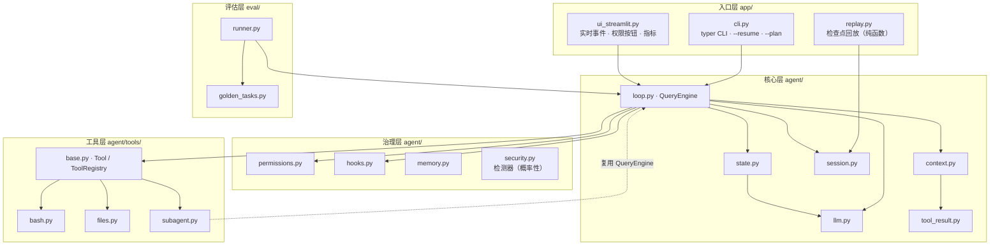
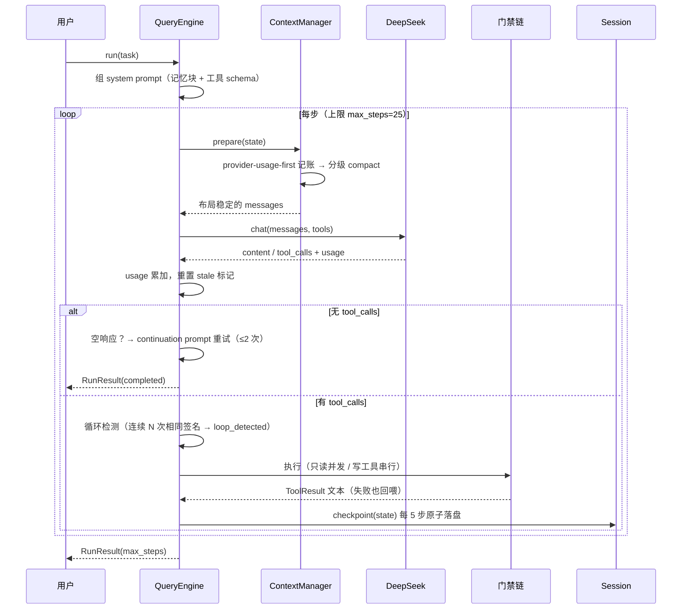
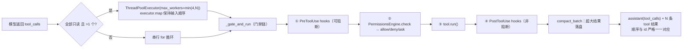
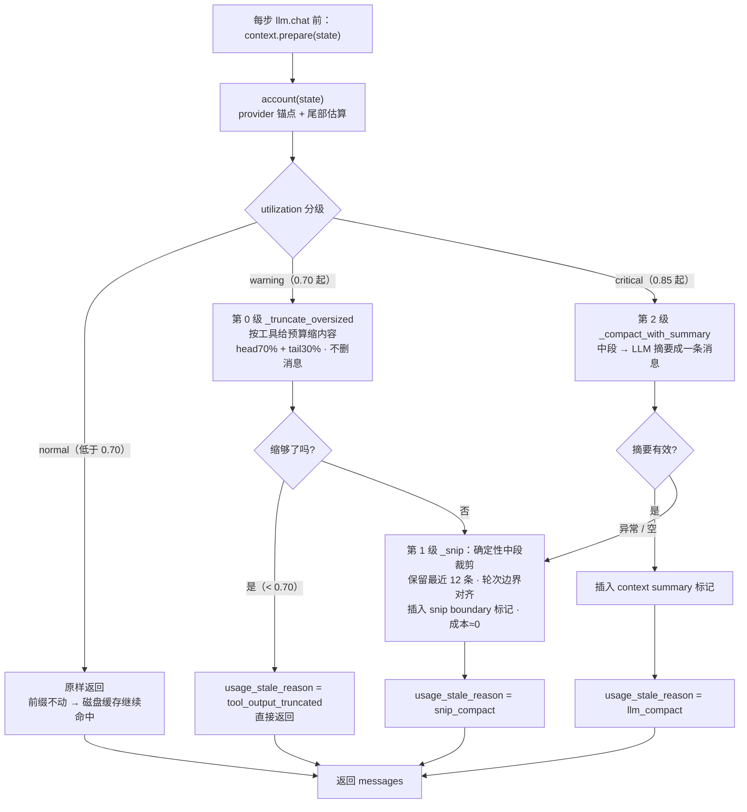
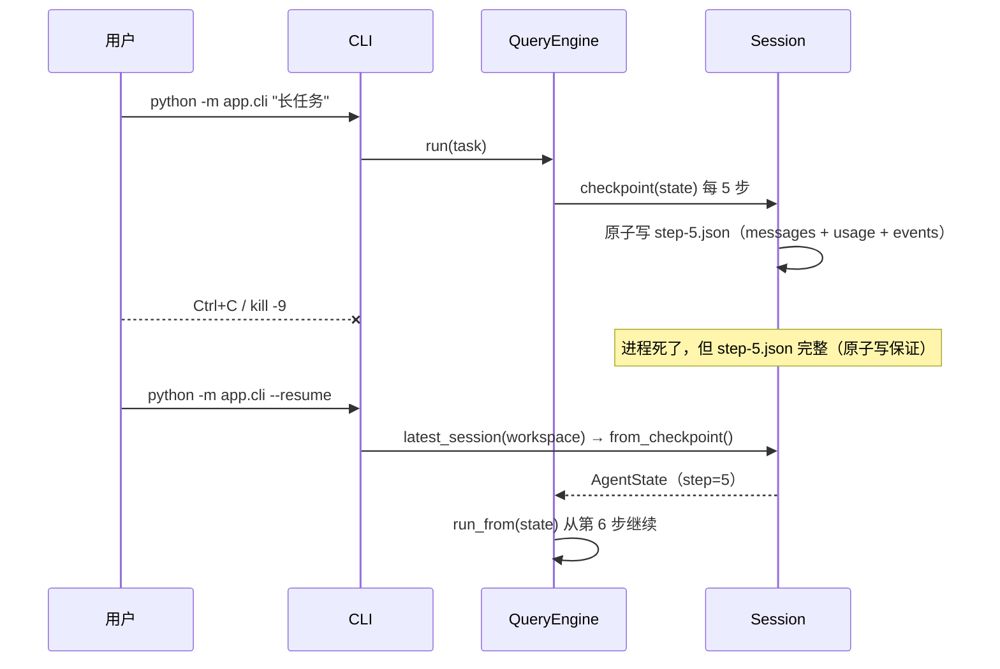
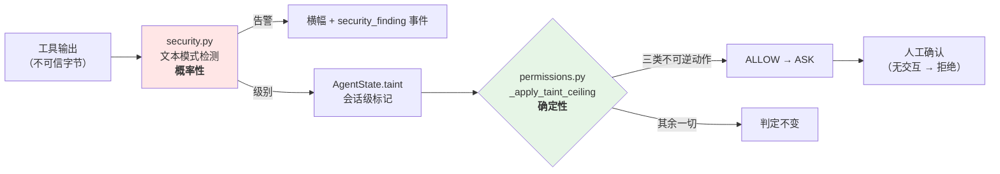
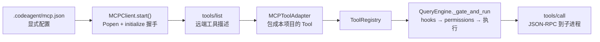
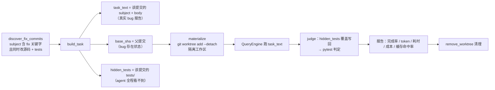

# CodeAgent 架构详解

> 逐层拆解 CodeAgent 的设计，并标注每一层对应 [Claude Code 源码](https://github.com/pengchengneo/Claude-Code) 的哪个机制。
> 配套阅读：[`docs/TECH_SPEC.md`](TECH_SPEC.md)（签名级规格）· [`docs/reference/claude-code-notes.md`](reference/claude-code-notes.md)（调研笔记）

## 0. 三条设计原则

1. **运行时拥有循环，模型只输出动作。** 循环、步数上限、终止判定、权限、落盘全部在 `QueryEngine` 里；LLM 每轮只做一件事——返回 `content` 或 `tool_calls`。这与 Claude Code 的 `QueryEngine.ts`、offer-Master 的 `LoopAgentController` 同构：**agent 的可靠性来自运行时的确定性，而不是提示词的祈祷。**
2. **核心手写，支撑层用成熟库。** 循环 / 工具协议 / 上下文治理 / 权限 / 检查点全部手写——这是「懂 agent 底层」的证据；HTTP 调用（openai SDK）、schema 校验（pydantic v2）、UI（streamlit）、CLI（typer）用成熟库，不重复造轮子。
3. **不确定的地方要能恢复，而不是假设不会发生。** 空响应 → 重试；工具失败 → 错误回喂模型自修复；compact 的 LLM 摘要失败 → 退化为确定性裁剪；进程被杀 → 检查点续跑；agent 没修好 bug → 评估如实记 0 分。

## 1. 分层与依赖方向

依赖**单向向下**：入口层 → 核心层 → 治理层/工具层；评估层旁挂（驱动核心层，不被核心层依赖）。核心层不 import streamlit / typer，所以能被 eval runner 和测试直接复用。



## 2. 一轮任务的生命周期



终止判定有五条出口，都会写进 `RunResult.terminated_reason`（轨迹和报告里可审计）：

| terminated_reason | 触发条件 | 语义 |
|---|---|---|
| `completed` | 模型不再调工具（且内容非空，或空响应重试用尽） | 正常完成 |
| `max_steps` | 达到 `max_steps`（默认 25） | 坍缩防护：硬上限 |
| `loop_detected` | 最近 4 步工具签名集合完全一致 | 坍缩防护：原地打转 |
| `error` | 循环内抛异常 | 明确失败，**不假装成功** |
| `await_user` | 模型调了 `ask_user`（`ToolResult.await_user=True`） | **半程暂停**，不是结论：等人补充信息后 `--resume "回答"` 续跑 |

## 3. 核心层

### 3.1 QueryEngine（`agent/loop.py`，547 行）

**只读工具并发，写工具串行** —— 直接照搬 Claude Code `query.ts` 的语义，也是与串行参考实现的主要差异：



关键约束：`executor.map` 而非 `as_completed`——**顺序必须与 `tool_calls` 一致**，因为 OpenAI 协议要求每条 `tool` 消息的 `tool_call_id` 与 assistant 的 `tool_calls` 对应，乱序会导致下一轮请求 400。

`_gate_and_run` 是统一门禁：**未知工具**（把可用工具名回喂，让模型自己改）、**hook 阻断**、**权限拒绝**都返回 `ToolResult.fail(...)`——工具层面没有「抛异常中断整个任务」，所有失败都是**文本回喂给模型自修复**。

### 3.2 LLM 抽象（`agent/llm.py`）

`BaseLLM` 两个实现，**接口完全一致**，所以循环、子代理、评估层共用一套代码：

- `DeepSeekClient`：走 openai SDK（DeepSeek 兼容 OpenAI 协议），`chat()` 返回 `LLMResult(content, tool_calls, usage)`，`complete()` 给 compact 摘要用。
- `MockLLM`：`script(*responses)` 脚本化响应序列 / `text("...")` 固定响应 / `tool_then_text(...)`。**测试与无 key 演示都靠它**——340 个测试全部离线，不打网络。

`Usage` 里单独保留 `prompt_cache_hit_tokens` / `prompt_cache_miss_tokens`——这是 DeepSeek 磁盘缓存的**实测**字段，整个缓存命中率指标和成本估算都建立在它之上（不是估算出来的）。

### 3.3 状态与消息契约（`agent/state.py`）

**OpenAI Chat Completion 格式的 dict 是 loop 与 LLM 之间的唯一契约**，`state.py` 用四个构造器保证格式 100% 合法：`system()` / `user()` / `assistant_text()` / `assistant_tool_calls()` / `tool_result()`。

`AgentState` 是「数据面」，也是检查点落盘的对象：`messages` / `step` / `usage` / `events` / `terminated_reason` / `memory_blocks`，加上 M3 的两个记账字段 `last_usage`（provider 锚点）与 `usage_stale_reason`、M7 的 `taint`、M8 的 `plan`（agent 自己的任务计划）——**检查点按 `dataclasses.fields()` 全字段快照**，所以加字段自动落盘；唯一的例外是 `emitter`（运行时对象，故意不落盘）。

`record_event(type, **data)` 是唯一的埋点通道：事件进内存列表，**同时**经 `emitter` 回调写给 `Session`（JSONL + UI 实时流）。一处埋点，轨迹、控制台、评估三处消费。

### 3.4 上下文治理（`agent/context.py`，项目最核心的差异化）

**provider-usage-first 记账**（吸收自 MiniCode）：不去猜上下文有多大，而是**信任 provider 的实测值**——取最近一次 `llm.chat` 的 `usage.total_tokens` 作锚点，只对锚点之后的新增消息（尾部）做估算，`total = provider_total + 尾部估算`。compact 之后旧锚点失效，打上 `usage_stale_reason`，改为全量估算——**避免用旧 usage 度量新上下文**这个经典错误。

**三级 compact，先便宜后昂贵**（第 0 级只缩内容，第 1 级删消息，第 2 级才花钱调 LLM）：



**第 0 级的关键不变量**：**只在越过 0.70 时才跑**。低于阈值必须**逐字节不碰** ——
否则每个大工具结果在其生命周期内至少破坏一次前缀缓存。"只在阈值之上才动"不是优化开关，
破坏它**不会报错**：只有一条走平的命中率曲线和更贵的账单。`tests/test_context.py` 里
「utilization < 0.70 时消息逐字节不变」那条测试就是为它准备的（它是唯一挡得住这个改动的测试）。

**实测（2026-09-11，DeepSeek 官方通路；脚本与原始输出在 `m8verify/`，已 gitignore）**：
端到端 A/B（两臂只差本开关，两个压力区间）**命中率没降**，B−A 在 ±0.02% 以内，一个区间
两臂累计 hit token 逐 token 相同 —— 所以「不变量守住了」是**测出来的**。但**代价不是零，
只是被同一步触发的 LLM 摘要遮蔽了**：单次截断微观对照里，它省 5,128 token、付 **45,304
miss token（8.8 倍）**，该步命中率 100% → 28%（一次性，重发即回到基准）。代价的形状是
**后缀失效**——前缀缓存匹配到 `_head_tail` 保留的头部 70% 处才分叉，**被改的那条之后全算
未命中**，所以同样截 4,000 字符，截第 7 条比截第 17 条贵 **3.8 倍**。它**也没能免掉第 1/2 级**：
中段窗口要到 20 条消息才非空，那时 utilization 已 1.06~1.23。完整数据记在 `TASKS.md` 的
P7-d。**去留已拍板（2026-09-11）：保持现状** —— 不选"优先截最靠后的合格消息"是因为它
缓存账更好看但会**先丢掉最老的上下文**，而"最近的最相关"是比缓存算术更硬的约束。

**cache-aware 布局**（本项目独有，参考项目没有缓存概念）：`_PREFIX_LEN = 2`——**system + 首条 user 任务恒定在前两位**，compact 只动中段，绝不触碰前缀。DeepSeek 的磁盘缓存按前缀匹配，前缀稳定 → 命中率随会话推进持续上升，直接省钱。控制台把这条曲线画出来，并按公开定价（命中 ¥0.5/M vs 未命中 ¥2/M）实时估算省了多少钱。

这条布局在 M8 之后还多了**约束**的作用：移植任何机制前先问「它会不会改动 `_PREFIX_LEN`
之后的消息」。`update_plan` 就被它挡下过一次 —— 只取参考实现的**落盘**，不取它那种
**每步把计划快照注入对话**的做法（见 §4 与 MiniCode 笔记 §8）。

裁掉的中间消息**并没有丢**：完整内容仍在 `data/sessions/{sid}.jsonl` 里，snip/summary 标记都指向轨迹——所以检查点回放看到的是 compact 前的完整对话。

### 3.5 工具结果落盘（`agent/tool_result.py`）

纯截断会**丢信息**（模型再也看不到那部分内容）。改成落盘 + 预览：单条超阈值的结果写到 `data/tool-results/{session}/{id}.txt`，上下文里替换为「预览 + 完整路径」，模型（或用户）需要时能随时读回全文。`compact_batch` 还做**批次预算**——单条都没超，但一轮总量超限时按「最大优先」落盘。

### 3.6 会话、检查点、恢复（`agent/session.py`）

三个落盘职责，互不干扰：

| 产物 | 路径 | 写入时机 | 用途 |
|---|---|---|---|
| JSONL 轨迹 | `data/sessions/{sid}.jsonl` | 每个事件（append-only） | 完整审计；compact 裁掉的中段仍在此 |
| 检查点 | `data/checkpoints/{sid}/step-{N}.json` | 每 N 步（N 随会话落盘；`.tmp` → `replace` 原子写） | resume / 回放 |
| 工具结果原文 | `data/tool-results/{sid}/{id}.txt` | 超大结果产生时 | 上下文只留预览 + 路径 |



**续跑不重置 step 计数**——恢复的 `state.step` 继续推进，所以续跑产生的检查点不会覆盖恢复前的同名文件，轨迹里也没有歧义。

**节拍也是会话的事实**：`checkpoint_every` 随检查点落盘，`--resume` 不带这个参数时**沿用该会话当初的值**，不是回落 CLI 的默认 5。优先序是「显式传参 > 会话里记的 > 默认」，CLI 会把实际生效的节拍打印出来。这一条是 M8 真跑挖出来的第二半：第一半（`--resume --checkpoint-every 1` 传了不生效）更显眼，而这一半的代价同样是**静默**的——5 凑巧也是个合法节拍，命令成功、退出码 0，唯一证据是检查点数不涨。老检查点没有这个字段 → 回落默认；字段被手改坏 → 同样回落，**不夹成 1**（那会让一个已损坏的检查点变成"每步都写"）。

## 4. 治理层

| 模块 | 机制 | 对应的 Claude Code 设计 |
|---|---|---|
| `permissions.py` | 三类请求（path / command / edit）× 六级决策（`allow_once` / `allow_turn` / `allow_always` / `deny_once` / `deny_always` / `ask`）+ 危险命令黑名单 + 路径沙箱 | `permission.ts` 的最小权限原则；决策粒度吸收自 MiniCode |
| `hooks.py` | `PreToolUse` / `PostToolUse` 两个事件；内置 **block-at-submit** 示例 + marker 由测试结果自动维护（`default_engine()` 供两个入口共用） | Hooks：阻断型钩子是**确定性约束**，CLAUDE.md 只是建议 |
| `memory.py` | 分层指令文件（`CODEAGENT.md` < `MINI.md` < `CLAUDE.md` < `.codeagent/rules/*.md`）+ `@include` 递归 + sha256 去重 + 预算（单文件 8K / 总 20K）+ 任务后提取写回 | CLAUDE.md 机制 + Dream consolidation（简化为提取 + 去重） |
| `security.py` | 7 类文本模式检测（同现判据 + 物证分级）+ 会话级污染标记 + `spotlight` / `memory_frame` 来源框架。**概率性，只出告警** | 无直接对应；本项目对「不可信输入」的处理方式 |
| `skills.py` | 四层发现根（项目/用户 × `.codeagent`/`.claude`，先到先得，同名记 `skill_shadowed`）+ `extract_description` 启发式 + 单 skill 8K 预算 | Skills 渐进披露：**只有 name+简介常驻**，正文按需 `load_skill` |

**block-at-submit 是本项目最直观的 hook 演示**：`require_tests_before_commit` 包住 `Bash(git commit)`，检查 `data/tests_pass.marker` 是否存在——不存在就**阻断提交**并把「先去跑 pytest」回喂给模型，逼它进入「测试 → 修复 → 再提交」的循环。这是「用确定性代码约束 agent 行为」，比在提示词里写一百遍「记得跑测试」都管用。

> 这道门有个容易踩空的地方：如果 marker **只能由人/模型自己写**，那模型不跑测试也能 `write` 出这个文件解锁，门就成了摆设。所以配套的 `mark_tests_pass_on_success`（PostToolUse）负责**让 marker 只由真实测试结果产生**——测试命令退出码为 0 才写，失败则清除（避免拿上一次的通过记录去提交），非测试命令一律不动。两个 hook 由 `default_engine()` 一处组装，**CLI 与控制台共用**：`app/cli.py` 曾经整体漏接了 hooks 层，把构造收到一处就是为了不再出现「一个入口接了、另一个没接」。

**记忆的闭环**：`.codeagent/rules/learned.md` 是唯一可写的记忆文件。任务结束后 `extract_conventions` 从轨迹里提炼 `- ` 条目 → `consolidate`（归一化 / 子串包含合并 / hash 去重）→ `save_learned` 写回 → **下次 `discover` 自动包含**。约定因此跨会话生效，而且**排最后 = 优先级最高**（离当前工作区最近的知识最该被信任）。

`@include` 的安全边界值得单说：只接受相对路径，显式拒绝绝对路径、`..` 段（含 `sub/../x` 这种伪装）、沙箱逃逸；循环 include 做 seen 集合检测；文件缺失给占位注释而不是报错——**记忆文件坏了不该让整个任务崩掉**。

### 检测路径 vs 执行路径（M7）

这一层里有两类东西，混在一起谈会把整个安全叙事讲错：



**分界线是「谁在做判断」**：左边那半靠猜（文本匹配，改一个词就绕过），右边那半靠查表（标记级别 + 动作类别，两个可判定的量）。所以右边能进执行路径，左边不能 —— 左边只影响告警和标记，**从不直接决定放行/拒绝**。

这不是洁癖，是项目自己写在第 0 节的原则：**可靠性来自运行时的确定性，而不是提示词的祈祷**。把一个概率性分类器放进执行路径，等于把可靠性建立在猜测上；而且误报的代价会直接落在用户身上 —— CLI 没有确认交互，一次误判就是「本该能做的事突然做不了，且没有纠正的入口」。

**天花板的位置是这一层最要紧的一个坐标**（`permissions.py:_decide`）：

```python
1) 路径越界 → 硬 deny
2) 常驻记忆 _always   ┐
3) 本回合记忆 _turn   ├─ 用户的选择在这里
4) 规则判定 _rule_check ┘
5) 后置天花板  ← 必须在这里
6) ask → confirm()   ← 人的当场决定
```

- **不能写在 4) 里面**。写成规则链的一条分支会被 2)/3) 短路：用户只要开过一次 `allow_always`，任何基于规则的收紧就**永久失效**——而「记得越久越省事」正是用户去开它的原因，两个方向正好相反。
- **不能放在 6) 之后**。`confirm` 是一个真实的人当场作出的决定，自动机制不该反过来推翻它；否则人点了「允许」系统仍按拒绝处理，确认框就成了摆设。

**只收紧三类动作**（网络外发 / 读取凭据 / 写入记忆文件），判据是「一旦发生就收不回来」。`write` 一个普通源码文件、`ls`、`git status` 都在外面：它们可撤销、可由人复核，收紧它们只会让 agent 变成路障。误报成本是不对称的 —— 多收紧一类动作，就是多一类「本该能做的事突然做不了」，而漏判只是少一层告警（沙箱、危险命令黑名单、第三方工具授权这些**确定性门禁照常生效**）。

**三类判据都是词法的，所以「判据写多宽」这件事本身就是个取舍**。凭据那一类最终收敛成一句话：**high 会话里，提到凭据文件的 bash 命令都要人工确认**（`CREDENTIAL_MENTION`，不锚定末尾）。这不是一开始的设计 —— 原版要求「读动词 + 凭据路径」同现（动词表 `cat|type|head|tail|...`），而真跑时模型读 `.env` 用的是 `findstr ... .env`，**不在表里，天花板没生效**：命令正常执行、变量名进了上下文、轨迹里连一条 `gate_block` 都没有。枚举读动词是打地鼠，漏一个就等于这类动作完全没有天花板。收紧的代价是 `grep -rn "\.env" README.md` 这种只是提及的也会被拦 —— 只在 `high` 会话生效，且人一句话就能解除。

**这个 bug 是这一层最值得讲的一件事**：单测全绿，机制却不工作。原因不是正则写错，是**我的测试和我自己的判据共享同一个盲区** —— 测试里写的是 `cat .env`。只有真跑真模型才会用出 `findstr`。（同类还有一条：拒绝文案指引「`--clear-taint` 复位后重试」，但 `--resume` 原先静默丢掉位置参数，复位之后人根本没有办法把「请重试」送进会话，动线断在最后一步。两条都在真跑中发现、都已修，见 [TASKS.md](../TASKS.md) 与 README 的验证小节。）

**污染标记是会话级、粗粒度的**，不是逐值数据流追踪：做不到「这个字符串来自不可信来源、那个没有」。它只升不降，`AgentState` 上**刻意没有 `set_taint`** —— 不存在的 API 无法被某条代码路径误用去擦掉标记，唯一复位者是人的动作（`--clear-taint`），且复位本身会往轨迹里写 `taint_cleared`，所以 `--resume` 重算时不会被旧的 `security_finding` 抬回去。

> 「检测出问题 → 收紧能力 → 人解锁」这条链能成立，靠的是**后一半**。检测器换个说法就绕过（README「已知未修复的绕过路径」的 S1–S5 逐条写着），但一旦标记置上，收紧与解锁都是确定性的。

## 5. 工具层（`agent/tools/`）

统一协议（用 pydantic v2 对齐 Claude Code 的 zod `inputSchema`）：

```python
class Tool:
    name: str
    description: str
    Input: type[BaseModel]           # → 自动生成 JSON Schema 给模型
    def execute(self, args, ctx) -> ToolResult: ...
    def is_read_only(self) -> bool:  # 决定能否并发
```

| 工具 | 关键设计 |
|---|---|
| `bash` | subprocess + 超时 + 平台适配（Windows，**传字符串而非列表**——列表会走 `list2cmdline` 把内嵌双引号转义成 `\"`，`git commit -m "…"` 会因此直接失败）+ 危险命令过滤；**唯一能触达任意 shell 能力的工具，也是权限最严的** |
| `read` / `write` | 行号前缀输出、按需读片段；写入前路径沙箱校验 |
| `edit` | **唯一匹配**语义（匹配到 0 处或 >1 处都失败并回喂原因）+ 返回 diff；失败信息足够模型自己修正 |
| `glob` / `grep` | 结果截断 + 明确提示「还有更多」（照搬 CC 的 `TRUNCATED_MESSAGE`——**截断必须可感知**，否则模型以为看全了） |
| `subagent` | research 子代理（下节） |
| `ask_user` | **半程暂停**：返回 `ToolResult(await_user=True)` 就结束本回合，问题交给用户。**不进 `default()`**——headless 评测里没人在，模型一提问 eval 就提前终止 |
| `update_plan` | agent 自己的任务计划，写 `state.plan` 随检查点落盘；**每次传完整清单**；**不注入每轮消息**（那会破坏前缀缓存） |
| `load_skill` | 按需取 `SKILL.md` 正文；只读、可并发。名字来自 system prompt 里那份**只含 name+简介**的索引 |

### MCP 接入（`agent/mcp.py`，M6-3）

标准 MCP server 的工具也能接进来当普通工具用——**重点是它不需要改循环**：



- **必须显式配置才注册**（第三方 server 不受 workspace 沙箱约束，绝不进 `ToolRegistry.default`）；
- 只读性**只信 server 声明的 `annotations.readOnlyHint`**，没声明就当可写 → 串行执行；
- 但**照样过权限与 hooks**——这是把治理做成独立层的直接回报；
- **权限默认不放行**（M7）：`is_external()` 为真的工具归到 `external` 类，只有列进
  `mcp.json` 的 `allow`（或规则文件的 `external.allow`）才 `ALLOW`，否则 `ASK`。
  「接上第三方 server 就默认信任」是错的默认值，而门禁链本身不会替你做这个判断——
  能走门禁 ≠ 门禁有正确策略，这是 A2 修的东西。

传输实现的两个要点：stdout/stderr 各一个后台线程抽干（管道阻塞读没法设超时，Windows 上 `select` 也不支持 pipe），stdout → 队列（请求按 id 关联，`queue.get(timeout)` 天然支持超时），stderr → 环形缓冲（出错时带上 server 的真实报错）。适配器覆写 `schema()`（用远端 `inputSchema`）与 `run()`（跳过本地 pydantic 校验，参数原样透传——远端才是权威校验方）。

### research 子代理（`agent/tools/subagent.py`）

上下文经济学：一个复杂探索需要输入 X、过程累积 Y、产出结论 Z。跑 N 个，主上下文会累积 `(X+Y+Z)×N`；子代理把 `(X+Y)×N` 外包，主上下文只收 Z。

- **独立上下文**：子代理有全新的 `AgentState` + 专用 system prompt，与主循环的 messages / usage / compact 完全隔离；
- **受限只读**：只给 `glob` / `grep` / `read`（白名单），`_restricted_registry` **永不包含 subagent 自身** → 从结构上禁止无限递归；
- **复用循环**：内部直接跑同一个 `QueryEngine`，不复制一份循环代码；
- **失败如实**：超步或异常返回 `ToolResult.fail("[子代理 max_steps，N 步] …")`，**不假装成功**——主模型能据此决定自己上手。

## 6. 评估层（`eval/`）

评估集**不是编的**，是从 [tinydb](https://github.com/msiemens/tinydb) 的真实 git history 里挖的：



这个设计绕开了 SWE-bench 类任务的两个经典陷阱：

1. **测试泄漏** —— 判定用的测试如果 agent 能读到，就等于开卷考试。这里隐藏测试只在 judge 阶段写回，agent 跑的 base 工作区里没有它。
2. **任务描述失真** —— 把 fix 提交改写成谜语式任务描述，会让任务变得不可解。这里直接用提交的 subject + body，是**真实的、当时开发者自己写的** bug 报告。

`git worktree add --detach` 让每个任务有独立工作区且不污染主仓库；成本按 DeepSeek 公开定价用**实测 usage** 估算；agent 异常或 judge 异常**如实写进报告的 `error` 字段**——一个坏掉的 run 绝不会显示成 pass。

## 7. 落盘产物地图

| 路径 | 写入者 | 内容 | 谁读它 |
|---|---|---|---|
| `data/sessions/{sid}.jsonl` | `Session.emit` | 每事件一行 | 回放、审计 |
| `data/checkpoints/{sid}/step-N.json` | `Session._write` | state 快照（原子写） | `--resume`、控制台回放 |
| `data/tool-results/{sid}/{id}.txt` | `ToolResultStore` | 超大工具结果原文 | 模型按路径读回 |
| `data/tests_pass.marker` | `mark_tests_pass()` | 测试通过标记 | block-at-submit hook |
| `.codeagent/rules/learned.md` | `save_learned` | 任务中提炼的约定 | 下次会话的 `discover` |
| `data/eval/report-*.json` | `eval.runner` | 回归报告 | 人 / CI |

`data/` 与 `workspace/` 全部 gitignore——**产物是运行出来的，不进仓库**。

## 8. 与 Claude Code 的逐层映射

| Claude Code 机制 | CodeAgent 实现 | 差异 |
|---|---|---|
| `query.ts` 循环 + 只读并发 | `agent/loop.py` | 照搬语义；Python 用 `ThreadPoolExecutor.map` 保序 |
| Tool 接口（zod `inputSchema`） | `agent/tools/base.py` | 用 pydantic v2 自动生成 schema；参数扁平化避免 `$defs` |
| `needsPermissions` 工具自声明 | `Tool.is_read_only()` + 权限引擎 | 权限规则外置成引擎，工具只声明只读性 |
| 结果截断 + `TRUNCATED_MESSAGE` | `files.py` 的 glob/grep/read | 一致；额外做超大结果**落盘**而非纯截断 |
| `getContext()` 拼装上下文 | `agent/context.py` | 换成 cache-aware 布局 + 三级 compact（分级截断/snip/摘要，可为 DeepSeek 缓存省钱） |
| CLAUDE.md 机制 | `agent/memory.py` + 仓库根 `CLAUDE.md` | 一致；额外做提取写回（自进化） |
| SubAgent 只回结论 | `agent/tools/subagent.py` | 单 research 子代理，只读白名单，无递归 |
| block-at-submit hooks | `agent/hooks.py` | 一致（git commit 检查测试标记） |
| `/resume` + JSONL 轨迹 | `agent/session.py` | 做到 **step 级**检查点，可任务中途续跑 |
| MCP 工具接入 | `agent/mcp.py` | 手写同步 stdio 客户端（官方 SDK 是 async，与同步循环阻抗大）；MCP 工具走同一套权限/hooks |
| （无） | `eval/` | Claude Code 没有内置评估；本项目加了轨迹驱动评估 |
| CONTEXT_COLLAPSE 等五种压缩 | `context.py` 三级 compact | 只做 分级截断 + snip + LLM 摘要（复杂度/收益比最优） |

## 9. 关键决策与权衡

| 决策 | 备选 | 为什么这么选 |
|---|---|---|
| 核心循环手写 | LangGraph / Agent SDK | 循环是 agent 的「操作系统」；套框架能跑通，但讲不清步数上限、终止判定、并发语义是怎么实现的 |
| 只读工具并发 | 全部串行 | 探索阶段（read/grep/glob）互相独立，并发直接省墙钟时间；写操作必须保序 |
| token 记账以 provider usage 为准 | 纯本地估算 | 估算必然有偏差，而 provider 每轮都返回实测值；只在锚点之后的尾部用估算 |
| 三级 compact | 只用 LLM 摘要 | LLM 摘要又慢又贵还可能失败；0.70 先用零成本的「缩内容 + 确定性裁剪」就够，0.85 才值得上 LLM |
| 超大结果落盘而非截断 | 直接截断 | 截断是**永久丢信息**；落盘 + 路径让信息随时可取，成本只是一次文件写 |
| 隐藏测试 | 用现成测试判定 | 现成测试在 agent 的工作区里 = 开卷；hidden tests 只在 judge 时写回 |
| 失败一律文本回喂 | 抛异常终止 | 模型自修复能力很强，把错误原文给它往往比运行时硬编码处理更有效 |
| 不做向量 RAG | 加检索层 | Claude Code 自己就是 grep/glob/read 检索——**代码检索用精确匹配比向量更准**，且省掉一整层依赖 |
